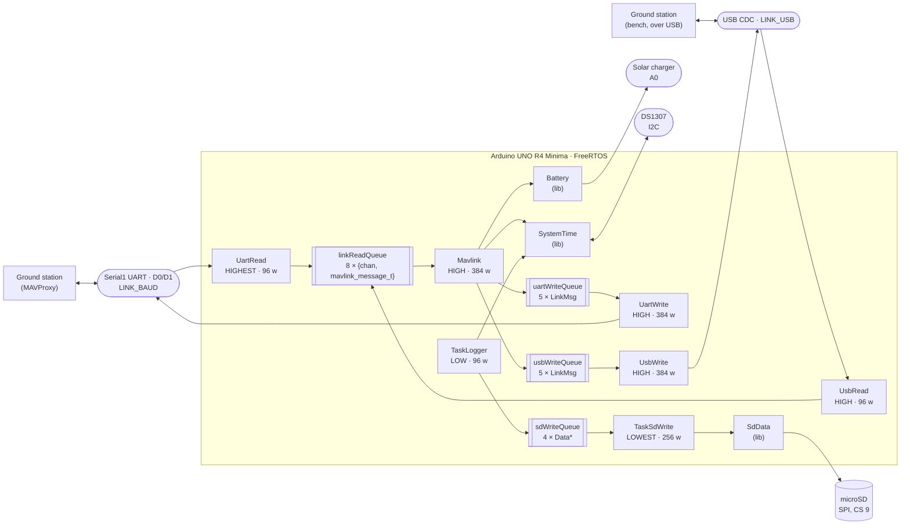

# Architecture

This document describes how the BoredomOS firmware is put together and why it is
split the way it is. It is the single source of truth for the design: `CLAUDE.md`
points here and keeps only what is specific to working with Claude Code, and
`TODO.md` holds everything that is planned but not yet built.

It documents the current state of the code. Anything that is wrong, missing or
inconsistent is tracked as an entry in [TODO.md](TODO.md) rather than described
here.

## 1. What this firmware is

BoredomOS is the on-board software of a CubeSat built on the
[Thingiverse 4096437](https://www.thingiverse.com/thing:4096437) mechanical design.
It runs on an **Arduino UNO R4 Minima** (Renesas RA4M1, Cortex-M4 at 48 MHz, 32 KB
of RAM) under **FreeRTOS**, and is built with PlatformIO.

The satellite presents itself to the ground as a **MAVLink vehicle**. It emits
periodic telemetry, accepts a small set of inbound messages, and keeps a local
housekeeping log on an SD card for the data that is too voluminous or too dull to
send over the link. MAVProxy is the reference ground control station.

Three things the firmware is *not*, which explain a lot of the code: it has no
control loops (nothing is actuated), it has no filesystem abstraction beyond a
fixed ring of log files, and it has no dynamic configuration — the wiring, the
identity on the bus and the telemetry rates are all compiled in.

## 2. The whole system at a glance



Read it as three independent flows sharing one board: everything on the top path is
the MAVLink link — two ports of it, sharing one inbound queue and one protocol task
but keeping a write queue and a writer each — the middle path is the housekeeping
log, and `SystemTime` is the clock that both of them stamp their data with.

There is no console task. The USB port carried a read-only text CLI until
`replace-console-cli-with-usb-mavlink-link`; it is a MAVLink endpoint now, and the
numbers `ps` and `free` used to print reach the ground as the housekeeping stream
(§5.1) instead.

## 3. Runtime model

**One composition root.** `src/main.cpp` is the only file that creates anything.
It defines the shared objects (`battery`, `systemTime`), the two `LinkPort`
descriptors, the four queue handles and the seven task handles, then creates every task in `setup()` and calls
`vTaskStartScheduler()`. `loop()` is empty and never runs.

**One task per translation unit.** Every other `src/*.cpp` is a task body — or a
small group of related ones — and reaches the shared objects through `extern`
declarations rather than headers. `src/logger.cpp` declares
`extern QueueHandle_t sdWriteQueue;` and `extern SystemTime systemTime;`.

`pvParameters` is `(void)`-cast away in every task **except the two link bodies**.
`replace-console-cli-with-usb-mavlink-link` runs `TaskLinkRead` and `TaskLinkWrite`
as two instances each, one per port, and an instance learns which port it serves
from the `LinkPort *` it is given. That is the one thing `pvParameters` is for, and
the alternative was duplicating both bodies. Nothing else uses it, and a new task
that is not per-port should not start.

Adding a subsystem therefore means four edits, always the same four:

1. Write the task body in a new `src/*.cpp`, reaching what it needs by `extern`.
2. Declare it `[[noreturn]] extern void TaskX(void *pvParameters);` in `src/main.cpp`.
3. Declare its storage there too — a `StackType_t xStack[N]` and a `StaticTask_t` — so
   the linker accounts for the task by name before it exists.
4. `xTaskCreateStatic` it in `setup()` with a priority from `include/Priority.h`, a
   stack size in words, and the storage from step 3. `configASSERT` the handle: with
   static storage a `NULL` can only mean a bad argument.

A fifth edit applies to any task whose stack is worth watching: add it to
`src/mavlink.cpp`'s housekeeping table and to `include/Data.h`, or its high-water
mark reaches neither the ground nor the SD log. Both follow the task count, and so
does each write queue's depth.

The one exception to the composition root is `sdData` in `src/sdwrite.cpp`: the
SD ring object is a file-scope global next to its only user, because nothing else
touches the card.

**Priorities are named, never numeric.** `include/Priority.h` defines
`PRIORITY_LOWEST` (0) through `PRIORITY_HIGHEST` (3). The ordering encodes what
must not be starved: reading the link is `HIGHEST` so the receive ring is drained
before it overflows, periodic telemetry and link writing are `HIGH`, protocol
handling and sampling are `LOW`, and SD writing is `LOWEST` because it blocks on
SPI and nothing waits for it.

The writers are deliberately **not** `HIGHEST`, even though they are serial I/O.
The core's `UART::write()` busy-waits until the frame is on the wire rather than
buffering and returning. At `HIGHEST` a single `BATTERY_STATUS` frame — 36 bytes of
payload, 48 on the wire once MAVLink 2 trims the trailing zeroes — would stall every
other task for 8.33 ms at 57600 baud. Nothing is lost by transmitting late — the
frame waits in that port's write queue — so both writers sit at `HIGH`, level with
their only producer, `Mavlink`.

`Mavlink` does not actually yield every cycle: `xQueueReceive` only blocks when
`linkReadQueue` is empty, and returns at once, without giving up the CPU, whenever
it already holds a frame. A sustained inbound stream could otherwise let `Mavlink`
run indefinitely at the same priority as the writers and starve them — found in
Copilot's review of `fold-periodic-telemetry-into-mavlink-task`, the change that
raised it to this band. `configUSE_TIME_SLICING` is `1` for exactly this:
at `configTICK_RATE_HZ = 1000` the scheduler round-robins same-priority ready tasks
every 1 ms regardless of whether either yields voluntarily, which is what actually
guarantees a writer its turn — not any property of `Mavlink`'s own code.
See `design.md` in that change.

It is also what keeps the idle task scheduled against a same-priority task that
spins, and therefore what keeps `vApplicationIdleHook()` refreshing the watchdog.
That mattered for the CLI at `PRIORITY_LOWEST` and matters again for `UsbWrite`,
whose `availableForWrite()` guard is the primary defence (§5.1).

**The seven tasks, and which configuration starts them.** Every task's storage is
declared unconditionally in `src/main.cpp` — the linker counts it whether or not
the task is started — but `setup()` only calls `xTaskCreateStatic` for five of
them in the reduced configuration described below. There were six until
`replace-console-cli-with-usb-mavlink-link` split the link pair per port and
deleted `TaskCli`.

| Task | File | Stack | Priority | Cadence | Reduced? |
|---|---|---|---|---|---|
| `UartRead` | `src/link.cpp` | 96 w | HIGHEST | polls every 10 ms, at most 128 B a pass | yes |
| `UsbRead` | `src/link.cpp` | 128 w | HIGH | polls every 10 ms, at most 128 B a pass | yes |
| `UartWrite` | `src/link.cpp` | 384 w | HIGH | blocks on `uartWriteQueue` | yes |
| `UsbWrite` | `src/link.cpp` | 384 w | HIGH | blocks on `usbWriteQueue` | yes |
| `Mavlink` | `src/mavlink.cpp` | 384 w | HIGH | blocks on `linkReadQueue`, wakes at least once a second for each port's schedule (`HEARTBEAT`/`SYSTEM_TIME` at 1 Hz, 500 ms apart; `BATTERY_STATUS` every 2 s, withheld in the reduced configuration) | yes, minus `BATTERY_STATUS` |
| `TaskLogger` | `src/logger.cpp` | 160 w | LOW | every 1 s | no, and not with no SD card either |
| `TaskSdWrite` | `src/sdwrite.cpp` | 256 w | LOWEST | blocks on `sdWriteQueue` | no, and not with no SD card either |

The two readers sit at different priorities and the reason is the hardware's, not
a preference: D0/D1 has no flow control wired, so bytes not drained in time are
**lost**, while USB CDC NAKs when its buffer fills and can only be delayed. Only
the port that can lose data needs `HIGHEST`.

`UsbWrite` is at `HIGH` only because `TaskLinkWrite` asks `availableForWrite()`
before writing. `_SerialUSB::write()` loops without yielding while its buffer is
full, so above idle priority a host that opens the port and stops reading would
keep `vApplicationIdleHook()` from running and let the watchdog reset the board.
The writer drops the frame instead, exactly as it already does when the queue is
full.

`TaskLogger` and `TaskSdWrite` use `vTaskDelayUntil` and `xQueueReceive` with
`portMAX_DELAY` respectively, against a `xLastWakeTime` seeded once for the former,
so their cadence does not drift and both cost nothing when idle. `TaskMavlink` is
the exception: it carries three periodic sends of its own (see §5.1) inside what is
otherwise a `linkReadQueue` consumer, so its `xQueueReceive` timeout is the time
to its next scheduled deadline rather than `portMAX_DELAY` — it wakes at least once
a second regardless of link traffic, never idle-free, which is by design rather than
a departure from the pattern above.

**The boot decision.** `setup()` reads `R_SYSTEM->RSTSR0/1/2` to learn why the
board reset, decodes it into one of five reasons (power-on, low-voltage,
watchdog, software, external/unknown), and updates two counters kept in
`R_SYSTEM->VBTBKR` — the RA4M1's battery-backed registers, which survive any
reset: a count of consecutive boots that never ran stably, and a cumulative
count only a ground command clears. After three consecutive unstable boots or
ten cumulative resets, `setup()` starts only the four link tasks and `Mavlink`
— the *reduced configuration*, which keeps the board
reachable and commandable without the SD card, the real-time clock or the battery
sense; `TaskMavlink`'s own schedule additionally withholds `BATTERY_STATUS` in this
configuration (see §5.1), so no task decides that at creation time any more.
`TaskMavlink` also carries the two mechanisms that get the board back out, since it
is the only task that runs in every configuration: it clears the consecutive
counter once the firmware has run for the 5-minute stability window, and, while
reduced, retries the normal configuration every 30 minutes. Both figures are
derived in `openspec/changes/add-degraded-mode/design.md`
from the heap's worst-case leak rate, not guessed. An independent watchdog,
refreshed only from the idle hook, turns a task that stops yielding into a
watchdog reset within `WDT_TIMEOUT_MS`. `include/Recovery.h` and `src/recovery.cpp`
own the register layout and the `PRCR`-unlocked access to it; `src/main.cpp` is
the only file that reads or writes the reset reason, the phase marker and the
counters, and `src/mavlink.cpp` reads them back for the heartbeat and the boot
`STATUSTEXT`. A byte written at each milestone of `setup()` — link, clock, card,
queues, tasks, scheduler-started, or one of the two fault hooks — is what makes a
halt during initialisation nameable at the next boot instead of a silent hang.

The reduced configuration and the watchdog are not finished: `vApplicationStackOverflowHook`
and `vApplicationMallocFailedHook` still rely on the watchdog eventually
underflowing to reset the board rather than resetting themselves, and a hang
during `setup()` before the idle hook first runs is caught only if it occurs
after the watchdog is opened. Both are open items, not this document's claim
about current behaviour.

## 4. Queue memory ownership protocol

This used to be one rule for all three queues. Since `queue-mavlink-messages-by-value`
it is two: `sdWriteQueue` still follows the heap-pointer protocol below; the two
MAVLink queues do not, because their items shrank enough to make by-value storage
cheaper than the heap-pointer machinery around it.

**`linkReadQueue` and the two write queues carry their items by value.**
`linkReadQueue`'s element is an `InboundMsg` (292 B): a full `mavlink_message_t`
plus the channel it arrived on, so the protocol task can answer on the port that
asked. One queue serves both readers rather than one each — a second 8-deep
message queue would cost 2328 B to distinguish what the tag distinguishes for 8.
Two producers cost nothing extra here, because a by-value queue has no
producer-held block to reserve.
Each port's write queue element is `LinkMsg` (`include/LinkMsg.h`, 64 B) — a tagged
union of what a producer *means* (a `HEARTBEAT` needs no payload at all; a
`STATUSTEXT` needs a severity and up to 50 characters, which is what sets the
union's size) rather than a wire-ready frame. `src/mavlink.cpp`'s `mavlinkPack()`
is the only place that turns a `LinkMsg` into a `mavlink_message_t`, called by
`TaskLinkWrite` just before it writes, with the channel it is about to leave by — this is also the only function outside
`src/mavlink.cpp` allowed to call a `mavlink_msg_*_pack` function, which is what
keeps protocol knowledge in the one file that owns it (§5.1) even though the
transport (`src/link.cpp`) now does the final packing step.

Their storage is `depth x sizeof(item)`, entirely in `.bss`, and none of them
touches the FreeRTOS heap: `linkReadQueueStorage` is 8 x 292 = 2336 B, and each of
`uartWriteQueueStorage` and `usbWriteQueueStorage` is 5 x 64 = 320 B. There is no producer/consumer margin
to add on top — with a by-value queue, an item "held before send" or "held after
receive" is simply a local on that task's own stack, not a shared block, so the
depth alone is what the storage needs.

**`sdWriteQueue` still carries a heap pointer**, because its item (`Data`, from
`include/Data.h`) is queued by `src/logger.cpp` and consumed by `src/sdwrite.cpp`,
and this protocol has not been revisited for it:

| Queue | Depth | Also in existence | Blocks | Bytes |
|---|---|---|---|---|
| `sdWriteQueue` | 4 | 1 producer, 1 consumer | 6 x 44 | 264 |

`sizeof(Data)` is 44 B, measured at compile time rather than counted by hand.
This table said `6 x 56` = 336 B until `replace-console-cli-with-usb-mavlink-link`
checked it: the item was 36 B then, so the figure had never been right and the
queue had always used less of the heap than documented. It is 44 B now because
that change took `Tasks` from five per-task marks to seven.

against `configTOTAL_HEAP_SIZE`, now `0x200` (512 B) — sized to this one queue with
margin, since neither MAVLink queue draws on the heap any more. The extra two
blocks beyond the depth are not slack: a producer allocates *before* it sends, so
learning that the queue is full costs a block beyond the depth; a consumer holds
one between `xQueueReceive` and `vPortFree`.

**The consequence is which failure a burst finds, and it now differs by queue.**
For `sdWriteQueue`, a saturated queue reports itself through `xQueueSend`, handled
by freeing the item; before that, the allocator could run out first and return
`NULL`. For the link queues, there is no allocator in the
path at all: a saturated queue simply does not accept the new item, and the
producer has nothing to free because it never held anything the queue didn't
already copy.

`sdWriteQueue`'s protocol has exactly three rules, and its producer and consumer
follow them:

1. **The producer allocates** with `pvPortMalloc`, fills the struct, and posts the
   pointer with `xQueueSend`.
2. **The producer frees on failure.** If `xQueueSend` does not return `pdPASS` the
   queue is full, the pointer was not handed over, and the producer must
   `vPortFree` it. Skipping this leaks, and on the heap this queue is now sized
   against, a leak is fatal within minutes.
3. **The consumer owns the pointer** once `xQueueReceive` returns it, and frees it
   after use — `TaskSdWrite` frees the `Data*` after copying it into the JSON
   document.

The reference implementation is `src/logger.cpp:38`, which also shows the fourth
half-rule: **check that `pvPortMalloc` returned something** before writing through
the pointer. `src/link.cpp` and `src/mavlink.cpp` do not call `pvPortMalloc`
at all — a CI step (`.github/workflows/main.yml`) greps those two files
specifically and fails the build if it reappears there.

## 5. The three pipelines

### 5.1 Serial ↔ MAVLink

`src/link.cpp` **owns both link ports**. It is the only file that performs I/O on
`LINK_UART` or `LINK_USB`; everything else that wants to talk to the ground posts a
message to a queue. Both ports in one file, not one file each: two owners of the
same class of resource is what would force mutexes.

No task waits for a port to become ready, but the two ports differ in what that
means. A hardware UART has no readiness to wait for, and the satellite must
transmit whether or not anyone is listening. A USB CDC port does have one:
`_SerialUSB::write()` returns 0 outright with no host attached, so those frames are
discarded rather than waited on — and when a host *is* attached but has stopped
draining, the writer checks `availableForWrite()` and drops the frame instead of
entering the library's non-yielding spin.

The ports and the UART's speed are named once, in `include/Link.h`, as
`LINK_UART`, `LINK_USB` and `LINK_BAUD`, with `LINK_CHAN_UART`/`LINK_CHAN_USB` for
their MAVLink channel numbers. All are `#ifndef`-guarded so `build_flags` can
override them without touching any protocol code. `LINK_BAUD` applies to the UART
alone; a CDC port has no line rate. Each alias must stay a macro naming a concrete
port, and `include/LinkPort.h` reaches them through function pointers onto
per-port wrappers for the same reason:
`UART` overloads `write(uint8_t*, size_t)` as non-const and never overrides `Print`'s
virtual const version, so reaching the port through a `HardwareSerial&` would
silently select the per-byte fallback.

- `TaskLinkRead` — two instances, one per port — drains up to 128 bytes a pass and
  feeds them one at a time to `mavlink_parse_char` on that port's channel. The cap
  bounds a loop that is otherwise unbounded; the UART cannot deliver more than 58 B
  into a 10 ms poll, but USB can. A complete message is posted to `linkReadQueue`
  **by value** (§4). The parser state is no longer file-static — it lives in each
  instance's `LinkPort`, because two tasks parse now and a shared buffer would let
  one port's frame be posted under the other's tag.
- `TaskLinkWrite` — two instances — blocks on its own port's write queue, receives a
  `LinkMsg` by value, calls `src/mavlink.cpp`'s `mavlinkPack()` with its channel to
  turn it into a `mavlink_message_t` on its own stack, converts that to wire format
  with `mavlink_msg_to_send_buffer` into a local buffer, checks the port will accept
  it, and writes the bytes. Nothing is freed, because nothing was allocated.

`src/mavlink.cpp` **owns the protocol**. Nothing else in the firmware knows what a
`msgid` is.

- `Mavlink` — one instance for both ports — consumes `linkReadQueue` (an
  `InboundMsg` by value, not a pointer) and dispatches on `msg.msgid`, replying on
  the port the item's `chan` names and never the other. Two
  messages are acted upon: `SYSTEM_TIME` sets the clock from the ground, and
  `TIMESYNC` with `tc1 == 0` is answered with the satellite's timestamp. Several
  more (`HEARTBEAT`, `PARAM_REQUEST_LIST`, `COMMAND_LONG`, `REQUEST_DATA_STREAM`,
  `FILE_TRANSFER_PROTOCOL`) have explicit cases that are deliberately empty — they
  are the reserved slots for the features in `TODO.md`. Anything else falls to
  `default` and produces a `STATUSTEXT` warning.
- The same task also carries the periodic telemetry that used to run as two
  separate tasks (folded in by `fold-periodic-telemetry-into-mavlink-task`, since
  both did nothing but pack a message and post it on a timer). A
  `{function, interval_ms, last_ms}` schedule table drives absolute deadlines:
  every pass emits whatever is due, then advances `last_ms += interval_ms` rather
  than to "now", so a late pass does not push the cadence forward — this is what
  replaces `vTaskDelayUntil`'s drift-free property now that the sends share a task
  with inbound dispatch. `HEARTBEAT` and `SYSTEM_TIME` fire every 1000 ms, the
  latter's `last_ms` seeded 500 ms behind so the two keep leaving 500 ms apart on
  the wire, exactly as when they alternated on their own `vTaskDelayUntil`.
  `BATTERY_STATUS` fires every 2000 ms, reading `lib/Battery`, and its schedule
  entry is the one disabled in the reduced configuration — the withholding is a
  table flag now, not a task `setup()` chooses not to create.
- A fourth entry publishes housekeeping — free heap, minimum-ever-free heap, and
  each live task's stack high-water mark — as one `NAMED_VALUE_INT` (252) per
  pass, round-robin, cycling back to the start after the last live value. It
  starts disabled **on each port independently**: nothing is sent on a port unless
  a ground station arms it there with
  `MAV_CMD_SET_MESSAGE_INTERVAL` targeting message id 252, and the requested
  interval (microseconds on the wire, converted to milliseconds here) is floored
  at 1000 ms — a faster request is answered `COMMAND_ACK` / `MAV_RESULT_DENIED`,
  not silently clamped. The floor holds the cadence guarantee above and bounds
  how often this entry can coincide with the other three on one pass, which is
  what each write queue's depth (§4) is sized against. Each port keeps its own
  armed flag, interval and position in the cycle, so arming one leaves the other
  alone. The armed state is session-scoped, not persisted: a reset returns every
  port to disabled.

**Sequence numbering is per port, and it is not free.** Every `mavlink_msg_*_pack`
call in `src/mavlink.cpp` is the `_pack_chan` form. The plain form takes its
sequence from channel 0 unconditionally, so with two ports both streams would share
one counter and each ground station would see gaps and infer packet loss.
`current_tx_seq` lives in `mavlink_status_t[chan]`, so passing the channel is the
whole of what keeps the two streams independent — and `MAVLINK_COMM_NUM_BUFFERS` in
`platformio.ini` must be at least the number of channels, which is why it is 2.

**Identity on the bus is fixed and must be identical in every outbound message, on
both ports:** system id `1`, component `MAV_COMP_ID_AUTOPILOT1`, type
`MAV_TYPE_ROCKET`, autopilot `MAV_AUTOPILOT_GENERIC`. A message packed with a
different triple appears to the GCS as a different vehicle or component, and the
two ports must show one vehicle rather than two.

### 5.2 Housekeeping log

The log exists for one purpose: **to size the stacks**. There is no other way to
know how close a 96-word task came to overflowing, and `configCHECK_FOR_STACK_OVERFLOW`
only tells you after the fact.

`src/logger.cpp` samples once a second into the `Data` struct of `include/Data.h`
and posts it to `sdWriteQueue`. The struct is the log schema: Unix time, uptime in
milliseconds, a `System` block with the free FreeRTOS heap and
`uxTaskGetStackHighWaterMark` for each of the seven tasks that can exist, and an
`Energy` block with the battery millivolts and charge percentage. `sizeof(Data)`
is 44 B. `mavlinkAvailableStack` covers `Mavlink`'s inbound dispatch *and* every periodic
send it carries for both ports (§5.1), so it is the figure that matters most when
checking whether that task's 384-word stack still fits.

**Three record shapes can share one card, and the field count no longer tells them
apart.** The oldest has seven per-task fields including `heartbeatAvailableStack`
and `batteryStatusAvailableStack`; `fold-periodic-telemetry-into-mavlink-task` cut
it to five; `replace-console-cli-with-usb-mavlink-link` took it back to seven, but
a different seven — `uartRead`/`uartWrite`/`usbRead`/`usbWrite` in place of
`serialRead`/`serialWrite`, and no CLI field in any of them. `lib/SdData`'s ring can
hold all three at once and nothing in the firmware reads a record back, so whoever
reads the `.mpk` files on the ground has to match on **field names**, not on how
many there are.

`src/sdwrite.cpp` **owns the card**. It converts the `Data` into an ArduinoJson
`JsonDocument` and hands it to `lib/SdData`, which — despite the JSON document —
serialises **MessagePack**: the `data0..N.mpk` files are binary, not text.

`lib/SdData` is a fixed-footprint ring, which is what bounds how much of the card
the log can ever occupy. It writes to `data<i>.mpk` until the file reaches its size
limit, then closes it, advances `i` modulo the file count, deletes whatever was
there and opens the next one. The current index is persisted in `index.bin`, so a
power cycle resumes where it left off instead of overwriting from zero. The
footprint is fixed by the two constructor arguments — file count and size per file,
defaulting to 4 files of 1 GiB.

### 5.3 Time

`lib/SystemTime` keeps two clocks in agreement: the RA4M1's internal `RTC`, which is
fast to read but loses time on power loss, and an external **DS1307** on I2C, which
is battery-backed but coarse.

- `begin()` seeds the internal clock from the DS1307 and fails — hard, via
  `configASSERT` in `setup()` — if either does not answer.
- `getUnixTime()` reads the internal clock. `getUnixTimeUsec()` and
  `getUnixTimeNsec()` scale it up for the MAVLink fields that want microseconds and
  nanoseconds.
- `setUnixTime()` writes both clocks and short-circuits when the value is already
  correct, so repeated time messages from the ground do not hammer the I2C bus.

The clock is settable from the ground: inbound `SYSTEM_TIME` and `TIMESYNC` in
`TaskMavlink` are what drive `setUnixTime()`. Every SD record carries the resulting
`unixtime`, which is the reference the `.mpk` files are read against later.

## 6. Hardware map and resource ownership

Wiring is hardcoded, not configurable. Changing a pin means changing the code.

| Resource | Where | Owned by |
|---|---|---|
| MAVLink link, `LINK_BAUD` | `LINK_UART` — `Serial1` on **D0** (`RX`) / **D1** (`TX`) | `src/link.cpp` |
| MAVLink link, USB CDC | `LINK_USB` (`Serial` by default) | `src/link.cpp` — the one exception is `src/hooks.cpp`, which writes from the stack-overflow hook after the scheduler has stopped |
| microSD card | SPI, CS on pin **9** | `src/sdwrite.cpp` via `lib/SdData` |
| Battery / solar charger sense | **A0** | `lib/Battery` |
| DS1307 real-time clock | I2C, address `0x68` | `lib/SystemTime` |
| Internal RTC | on-chip | `lib/SystemTime` |
| Status LED | `LED_BUILTIN` | `src/hooks.cpp` |
| Independent watchdog (WDT) | on-chip, opened in `setup()` | `src/main.cpp` opens it; `src/hooks.cpp`'s idle hook refreshes it |
| Backup registers (`R_SYSTEM->VBTBKR`) | on-chip, `[0..3]` the bootloader's, `[4..11]` this firmware's | `include/Recovery.h` / `src/recovery.cpp` own the layout and access; `src/main.cpp` is the only writer of its content |

The status LED carries the two faults that stop the board, and the patterns are
chosen to be told apart with nothing attached — which is the case they exist for:

| Pattern | Means |
|---|---|
| Slow symmetric blink, 2 s on and 2 s off | A task overflowed its stack |
| Two rapid blinks, then a pause of about a second | An allocation could not be satisfied |

Both hooks mask interrupts and never return, so neither pattern can be produced by a
board that is still running. Neither uses `delay()` or the serial port: the tick and
the USB interrupt are gone by the time they blink, so both busy-wait instead.

"Owned by" is the operative column: each of these has exactly one owner, and code
outside that owner reaches the resource through a queue or through the library
wrapper, never directly. That is what makes the absence of mutexes safe.

`lib/Battery` wraps the `SolarCharger` library on `A0` and caches readings for
125 ms, so several calls in the same telemetry cycle cost one ADC read.
`remaining()` is a naive linear map of 3.5 V–4.2 V onto 0–100 %, which is adequate
for a single LiPo cell and honest about being an estimate.

## 7. Constraints that shape the code

Most of what looks unusual in this firmware follows from four numbers.

**2916 bytes of headroom** (as of `replace-console-cli-with-usb-mavlink-link`,
which added a reader, a writer, a write queue and a second MAVLink channel and
recovered a little of it by deleting the CLI task — see §3's task table; read fresh
from
a build rather than trusted from here, since this figure moves whenever a change
touches `.data`, `.noinit` or `.bss`). Not 32 KB, and not what `pio run`'s own
printed percentage appears to leave free. Task stacks, control blocks and queue
structures are in `.bss`, counted by the linker; `configTOTAL_HEAP_SIZE` is
`0x200` and backs only `sdWriteQueue`'s items, since the link queues carry theirs
by value (§4); and `g_heap`, the main stack and the
vector table take another 9472 bytes that the printed figure omits.
`scripts/ram_budget.py` prints the honest total after every link and fails the build
before the headroom runs out. This is why `sdWriteQueue`'s items are still freed the
instant they are consumed, why the link queues carry by-value items instead once
their size made that cheaper, and why adding a library or a
task is a decision rather than a detail — but it is now a decision the build can
refuse.

**Stack sizes are in words, not bytes**, and they are tuned tight — 96 to 384 words,
384 to 1536 bytes. `configCHECK_FOR_STACK_OVERFLOW=2` is enabled and
`src/hooks.cpp` traps an overflow into a slow `LED_BUILTIN` blink with interrupts
disabled, and an allocation failure into a fast double blink. **A blinking board means
a stack is too small or memory ran out, not a wiring fault** — the two patterns are in
section 6. After changing any task body, check that task's high-water mark in the SD
log before assuming it still fits.

**Four priority levels**, from `include/Priority.h`, never raw numbers. FreeRTOS is
configured with `configMAX_PRIORITIES` of 5 and a 1000 Hz tick.

**`configASSERT` halts only where recovery is impossible, not where hardware is
missing.** The question `setup()` asks is not "is this important" but "does the
firmware need it to be reachable" — and the answer is: the link, and nothing
else. Absent RTC or SD card degrade instead of halting: the board runs on ticks
since boot and accepts a time set from the ground without the DS1307, and skips
the housekeeping log without the card, reporting the absence either way rather
than staying silent about it. `configASSERT` remains on each queue creation and
each task creation — with `configSUPPORT_STATIC_ALLOCATION` these cannot fail
for want of memory, so a `NULL` handle there is a programming error, not a
hardware fault, and stopping on it is still correct. See
`openspec/changes/add-degraded-mode/` for the reasoning and
`specs/fault-recovery/spec.md` for what a degraded board must still do.

## 8. Build, flash and test

```bash
pio run                  # build — this is all CI runs
pio run -t upload        # flash the board
mavproxy.py --master=/dev/ttyACM0 --load-module system_time       # over USB
mavproxy.py --master=<uart port>,57600 --load-module system_time  # over D0/D1
```

`<uart port>` is whatever is wired to D0/D1: the telemetry radio, or a USB-TTL
adapter on the bench. Since `replace-console-cli-with-usb-mavlink-link`,
`/dev/ttyACM0` carries MAVLink again — in every build, not behind an override —
so a ground station reaches the flight firmware over the USB cable with nothing
else attached. Both ports are live at once and each shows the same vehicle.

`pio device monitor` is no longer useful: the USB port carries binary MAVLink
frames, not text. There is no console and no CLI. The `ps` and `free` figures it
used to print — free heap, minimum-ever-free heap and each live task's stack
high-water mark — reach the ground as the `NAMED_VALUE_INT` housekeeping stream
instead (§5.1), armed by `MAV_CMD_SET_MESSAGE_INTERVAL` and off after every
reset.

That is a loss as well as a gain, and worth stating plainly: `ps` answered
immediately, with every task at once, from any terminal. The housekeeping stream
needs `pymavlink`, an arming command, and about eight seconds to cycle the whole
set at the 1000 ms floor — and it travels through the subsystem you are most
likely to be debugging.

The stack-overflow hook in `src/hooks.cpp` still writes text to the USB port
directly, after the scheduler has stopped. Nothing else does.

**There is no host test environment.** `test/` holds two suites, and they test
different things:

| Suite | Command | What runs where | Covers |
|---|---|---|---|
| `test/test_hil/` | `pio test` | Python on the development machine, over either port | the real firmware, seen as the ground station sees it |
| `test/test_libs/` | `pio test -e libs` | Unity on the board, replacing the firmware | `lib/` only — `Battery`, `SystemTime`, `SdData`, linked against the Arduino core |

**The default is the HIL suite**, and that is deliberate. It flashes the firmware that
flies and leaves it running; the Unity suite replaces the firmware with a test binary
and erases the log from the card on every case, so it is opt-in.

`test_libs/test_main.cpp` asserts against a real battery voltage, a real DS1307 and a
real SD card, so `pio test` needs the assembled board and cannot run in CI. All its
cases live in that one file and are dispatched by hand from `runUnityTests()`; to run
a single one, comment out the other `RUN_TEST(...)` lines. `pio test -f` filters test
*directories*, so it selects a suite, not a case.

**`test_libs` does not cover `src/` at all.** `test_build_src` defaults to `no`, so
the test binary contains no `main.cpp`, no task creation and no scheduler: it cannot
observe a task, a queue, a stack high-water mark or the ownership protocol. The
section sizes show it — the Unity binary links 5340 bytes of RAM and contains no
`ucHeap`, no `vTaskStartScheduler` and no `xTaskCreateStatic` at all. A green
`pio test -e libs` says nothing about a task body. Note that `test_build_src` governs
`pio test`, not `pio run`: `pio run -e libs` builds the application and carries the
same static storage as the flight build.

**What the build reports, and what it does not.** `pio run` prints
`.data + .noinit + .bss` — about 60 % — which now moves when a task
or a queue's storage is added or resized, because the stacks, control blocks and
queue storage are in `.bss`. It still leaves out `g_heap`, the main stack and the
vector table, another 9472 bytes, so on its own it understates the commitment.
`scripts/ram_budget.py` runs after every link and prints the honest figure:
**29852 bytes committed of 32768, 2916 bytes of headroom** (as of
`replace-console-cli-with-usb-mavlink-link`; read fresh from a build rather than
trusted from here, since this figure moves whenever a change touches `.data`,
`.noinit` or `.bss`).
That headroom is what a new subsystem has to fit into, and the build fails if it drops
below the floor in `platformio.ini`.

`test_hil/` is what exercises the assembled firmware. `run.py` discovers the cases,
prints Unity's line format so `pio test` counts them natively, and reports anything it
cannot check — no board, no adapter — as skipped rather than failed. Most of its
cases follow the scenarios in `openspec/specs/mavlink-link/spec.md`, and three, in
`check_recovery.py`, follow `fault-recovery`. `console-cli` no longer exists, so
neither do the cases that covered it.

Which case covers which scenario is still not recorded, and the suite has grown
since anyone last counted — see *Record which scenario each HIL case covers* in
[TODO.md](TODO.md). Two steps nothing here can run at all are written down in
`test/test_hil/README.md` rather than left to look covered.

Its `build_stub.cpp` is not a test. PlatformIO counts the sources it compiled from the
suite directory and refuses to build before it ever reaches `src/`, so a suite that is
entirely host-side Python needs one translation unit to exist at all.

Two environments share the board: `uno_r4_minima` is the flight build and the
default for every command, and `libs` exists only to run the Unity suite. There
were three until `replace-console-cli-with-usb-mavlink-link` retired `bench`,
which existed to move MAVLink onto USB so the HIL suite could run without an
adapter — USB carries MAVLink in every build now, so there is nothing left for
that override to do, and nothing to reflash afterwards to get back to the
configuration that flies.

## What is not here

Planned work, open decisions and known defects live in [TODO.md](TODO.md), one
entry each, defined before any code is written for them. This document describes
what exists; that one describes what should.
