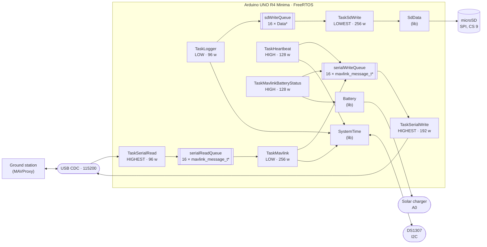

# Architecture

This document describes how the BoredomOS firmware is put together and why it is
split the way it is. It is the single source of truth for the design: `CLAUDE.md`
points here and keeps only what is specific to working with Claude Code, and
`TODO.md` holds everything that is planned but not yet built.

It documents the current state of the code. Anything that is wrong, missing or
inconsistent is tracked as an entry in [TODO.md](TODO.md) rather than described
here.

## 1. What this firmware is

BoredomOS is the on-board software of a CubeSat built on the
[Thingiverse 4096437](https://www.thingiverse.com/thing:4096437) mechanical design.
It runs on an **Arduino UNO R4 Minima** (Renesas RA4M1, Cortex-M4 at 48 MHz, 32 KB
of RAM) under **FreeRTOS**, and is built with PlatformIO.

The satellite presents itself to the ground as a **MAVLink vehicle**. It emits
periodic telemetry, accepts a small set of inbound messages, and keeps a local
housekeeping log on an SD card for the data that is too voluminous or too dull to
send over the link. MAVProxy is the reference ground control station.

Three things the firmware is *not*, which explain a lot of the code: it has no
control loops (nothing is actuated), it has no filesystem abstraction beyond a
fixed ring of log files, and it has no dynamic configuration — the wiring, the
identity on the bus and the telemetry rates are all compiled in.

## 2. The whole system at a glance



Read it as three independent flows sharing one board: everything on the top path is
the MAVLink link, the middle path is the housekeeping log, and `SystemTime` is the
clock that both of them stamp their data with.

## 3. Runtime model

**One composition root.** `src/main.cpp` is the only file that creates anything.
It defines the shared objects (`battery`, `systemTime`), the three queue handles
and the seven task handles, then creates every task in `setup()` and calls
`vTaskStartScheduler()`. `loop()` is empty and never runs.

**One task per translation unit.** Every other `src/*.cpp` is a task body — or a
small group of related ones — and reaches the shared objects through `extern`
declarations rather than headers. `src/logger.cpp` declares
`extern QueueHandle_t sdWriteQueue;` and `extern SystemTime systemTime;`; nothing
is passed through `pvParameters`, which is `(void)`-cast away in every task.

Adding a subsystem therefore means three edits, always the same three:

1. Write the task body in a new `src/*.cpp`, reaching what it needs by `extern`.
2. Declare it `[[noreturn]] extern void TaskX(void *pvParameters);` in `src/main.cpp`.
3. `xTaskCreate` it in `setup()` with a priority from `include/Priority.h` and a
   stack size in words.

The one exception to the composition root is `sdData` in `src/sdwrite.cpp`: the
SD ring object is a file-scope global next to its only user, because nothing else
touches the card.

**Priorities are named, never numeric.** `include/Priority.h` defines
`PRIORITY_LOWEST` (0) through `PRIORITY_HIGHEST` (3). The ordering encodes what
must not be starved: serial I/O is `HIGHEST` because bytes are lost if the UART is
not drained, periodic telemetry is `HIGH`, protocol handling and sampling are
`LOW`, and SD writing is `LOWEST` because it blocks on SPI and nothing waits for
it.

**The seven tasks:**

| Task | File | Stack | Priority | Cadence |
|---|---|---|---|---|
| `TaskSerialRead` | `src/serial.cpp` | 96 w | HIGHEST | polls every 10 ms |
| `TaskSerialWrite` | `src/serial.cpp` | 192 w | HIGHEST | blocks on `serialWriteQueue` |
| `TaskHeartbeat` | `src/mavlink.cpp` | 128 w | HIGH | `HEARTBEAT` and `SYSTEM_TIME`, alternating every 500 ms |
| `TaskMavlinkBatteryStatus` | `src/mavlink.cpp` | 128 w | HIGH | every 2 s |
| `TaskMavlink` | `src/mavlink.cpp` | 256 w | LOW | blocks on `serialReadQueue` |
| `TaskLogger` | `src/logger.cpp` | 96 w | LOW | every 1 s |
| `TaskSdWrite` | `src/sdwrite.cpp` | 256 w | LOWEST | blocks on `sdWriteQueue` |

Periodic tasks use `vTaskDelayUntil` against a `xLastWakeTime` seeded once, so the
cadence does not drift with the work done in the body. Consumer tasks block on
`xQueueReceive` with `portMAX_DELAY` and cost nothing when idle.

## 4. Queue memory ownership protocol

This is the rule most easily broken, so it is stated on its own.

**Queues carry heap pointers, never values.** All three queues are declared with
`sizeof(T*)` as their element size. A queue of 16 `mavlink_message_t` by value
would be 4.6 KB of the 8 KB heap standing permanently reserved; a queue of 16
pointers is 64 bytes, and the messages themselves exist only while they are in
flight.

The protocol has exactly three rules, and every producer and consumer follows them:

1. **The producer allocates** with `pvPortMalloc`, fills the struct, and posts the
   pointer with `xQueueSend`.
2. **The producer frees on failure.** If `xQueueSend` does not return `pdPASS` the
   queue is full, the pointer was not handed over, and the producer must
   `vPortFree` it. Skipping this leaks, and on 8 KB of heap a leak is fatal within
   minutes.
3. **The consumer owns the pointer** once `xQueueReceive` returns it, and frees it
   after use — `TaskSdWrite` frees the `Data*` after copying it into the JSON
   document, `TaskMavlink` frees the `mavlink_message_t*` at the end of the switch,
   `TaskSerialWrite` frees it as soon as the frame is serialised into its local
   buffer.

The reference implementations are `src/logger.cpp:42` and `src/serial.cpp:50`,
which also show the fourth half-rule: **check that `pvPortMalloc` returned
something** before writing through the pointer.

## 5. The three pipelines

### 5.1 Serial ↔ MAVLink

`src/serial.cpp` **owns the UART**. It is the only file that performs I/O on
`Serial`; everything else that wants to talk to the ground posts a message to a
queue. Other tasks may wait on `while (!Serial)` before publishing, because the USB
CDC is not ready until a host opens the port, but they never read or write it.

- `TaskSerialRead` drains available bytes and feeds them one at a time to
  `mavlink_parse_char`. When a complete message is parsed it is copied to the heap
  and posted to `serialReadQueue`. The parser state (`msg_to_read`, `status`) is
  file-static, which is safe because exactly one task parses.
- `TaskSerialWrite` blocks on `serialWriteQueue`, converts each message to wire
  format with `mavlink_msg_to_send_buffer` into a local buffer, frees the message,
  and writes the bytes.

`src/mavlink.cpp` **owns the protocol**. Nothing else in the firmware knows what a
`msgid` is.

- `TaskMavlink` consumes `serialReadQueue` and dispatches on `msg->msgid`. Two
  messages are acted upon: `SYSTEM_TIME` sets the clock from the ground, and
  `TIMESYNC` with `tc1 == 0` is answered with the satellite's timestamp. Several
  more (`HEARTBEAT`, `PARAM_REQUEST_LIST`, `COMMAND_LONG`, `REQUEST_DATA_STREAM`,
  `FILE_TRANSFER_PROTOCOL`) have explicit cases that are deliberately empty — they
  are the reserved slots for the features in `TODO.md`. Anything else falls to
  `default` and produces a `STATUSTEXT` warning.
- `TaskHeartbeat` alternates `HEARTBEAT` and `SYSTEM_TIME`, 500 ms apart, so each
  goes out at 1 Hz.
- `TaskMavlinkBatteryStatus` emits `BATTERY_STATUS` every 2 s, reading `lib/Battery`.

**Identity on the bus is fixed and must be identical in every outbound message:**
system id `1`, component `MAV_COMP_ID_AUTOPILOT1`, type `MAV_TYPE_ROCKET`,
autopilot `MAV_AUTOPILOT_GENERIC`. A message packed with a different triple appears
to the GCS as a different vehicle or component.

### 5.2 Housekeeping log

The log exists for one purpose: **to size the stacks**. There is no other way to
know how close a 96-word task came to overflowing, and `configCHECK_FOR_STACK_OVERFLOW`
only tells you after the fact.

`src/logger.cpp` samples once a second into the `Data` struct of `include/Data.h`
and posts it to `sdWriteQueue`. The struct is the log schema: Unix time, uptime in
milliseconds, a `System` block with the free FreeRTOS heap and
`uxTaskGetStackHighWaterMark` for each of the seven tasks, and an `Energy` block
with the battery millivolts and charge percentage.

`src/sdwrite.cpp` **owns the card**. It converts the `Data` into an ArduinoJson
`JsonDocument` and hands it to `lib/SdData`, which — despite the JSON document —
serialises **MessagePack**: the `data0..N.mpk` files are binary, not text.

`lib/SdData` is a fixed-footprint ring, which is what bounds how much of the card
the log can ever occupy. It writes to `data<i>.mpk` until the file reaches its size
limit, then closes it, advances `i` modulo the file count, deletes whatever was
there and opens the next one. The current index is persisted in `index.bin`, so a
power cycle resumes where it left off instead of overwriting from zero. The
footprint is fixed by the two constructor arguments — file count and size per file,
defaulting to 4 files of 1 GiB.

### 5.3 Time

`lib/SystemTime` keeps two clocks in agreement: the RA4M1's internal `RTC`, which is
fast to read but loses time on power loss, and an external **DS1307** on I2C, which
is battery-backed but coarse.

- `begin()` seeds the internal clock from the DS1307 and fails — hard, via
  `configASSERT` in `setup()` — if either does not answer.
- `getUnixTime()` reads the internal clock. `getUnixTimeUsec()` and
  `getUnixTimeNsec()` scale it up for the MAVLink fields that want microseconds and
  nanoseconds.
- `setUnixTime()` writes both clocks and short-circuits when the value is already
  correct, so repeated time messages from the ground do not hammer the I2C bus.

The clock is settable from the ground: inbound `SYSTEM_TIME` and `TIMESYNC` in
`TaskMavlink` are what drive `setUnixTime()`. Every SD record carries the resulting
`unixtime`, which is the reference the `.mpk` files are read against later.

## 6. Hardware map and resource ownership

Wiring is hardcoded, not configurable. Changing a pin means changing the code.

| Resource | Where | Owned by |
|---|---|---|
| USB CDC serial, 115200 | `Serial` | `src/serial.cpp` |
| microSD card | SPI, CS on pin **9** | `src/sdwrite.cpp` via `lib/SdData` |
| Battery / solar charger sense | **A0** | `lib/Battery` |
| DS1307 real-time clock | I2C, address `0x68` | `lib/SystemTime` |
| Internal RTC | on-chip | `lib/SystemTime` |
| Status LED | `LED_BUILTIN` | `src/hooks.cpp` |

"Owned by" is the operative column: each of these has exactly one owner, and code
outside that owner reaches the resource through a queue or through the library
wrapper, never directly. That is what makes the absence of mutexes safe.

`lib/Battery` wraps the `SolarCharger` library on `A0` and caches readings for
125 ms, so several calls in the same telemetry cycle cost one ADC read.
`remaining()` is a naive linear map of 3.5 V–4.2 V onto 0–100 %, which is adequate
for a single LiPo cell and honest about being an estimate.

## 7. Constraints that shape the code

Most of what looks unusual in this firmware follows from four numbers.

**8 KB of FreeRTOS heap.** `configTOTAL_HEAP_SIZE` is `0x2000` on this port, out of
32 KB of RAM total. Task stacks, TCBs and every queued message come out of it. This
is why queues carry pointers, why messages are freed the instant they are consumed,
and why adding a library is a decision rather than a detail.

**Stack sizes are in words, not bytes**, and they are tuned tight — 96 to 256 words,
384 to 1024 bytes. `configCHECK_FOR_STACK_OVERFLOW=2` is enabled and
`src/hooks.cpp` traps an overflow into a slow `LED_BUILTIN` blink with interrupts
disabled. **A board blinking slowly on boot means a stack is too small, not a wiring
fault.** After changing any task body, check that task's high-water mark in the SD
log before assuming it still fits.

**Four priority levels**, from `include/Priority.h`, never raw numbers. FreeRTOS is
configured with `configMAX_PRIORITIES` of 5 and a 1000 Hz tick.

**`configASSERT` halts rather than degrades.** `setup()` asserts on the RTC, the SD
card and each queue creation. A CubeSat with no clock or no log is not a CubeSat
flying in a degraded mode; it is a CubeSat whose data cannot be trusted afterwards.
Missing hardware stops the board on purpose.

## 8. Build, flash and test

```bash
pio run                  # build — this is all CI runs
pio run -t upload        # flash the board
pio device monitor       # serial console at 115200
mavproxy.py --master=/dev/ttyACM0,115200 --load-module system_time
```

Note that `pio device monitor` shows raw MAVLink frames, not text: the same port
carries the binary link, so the monitor is only useful for confirming that bytes
are moving.

**There is no host test environment.** `test/test_main.cpp` asserts against a real
battery voltage, a real DS1307 and a real SD card, so `pio test` needs the assembled
board and cannot run in CI or on a development machine. All cases live in that one
file and are dispatched by hand from `runUnityTests()`; to run a single one, comment
out the other `RUN_TEST(...)` lines, since `pio test -f` filters test *directories*
and there is only one.

## What is not here

Planned work, open decisions and known defects live in [TODO.md](TODO.md), one
entry each, defined before any code is written for them. This document describes
what exists; that one describes what should.
