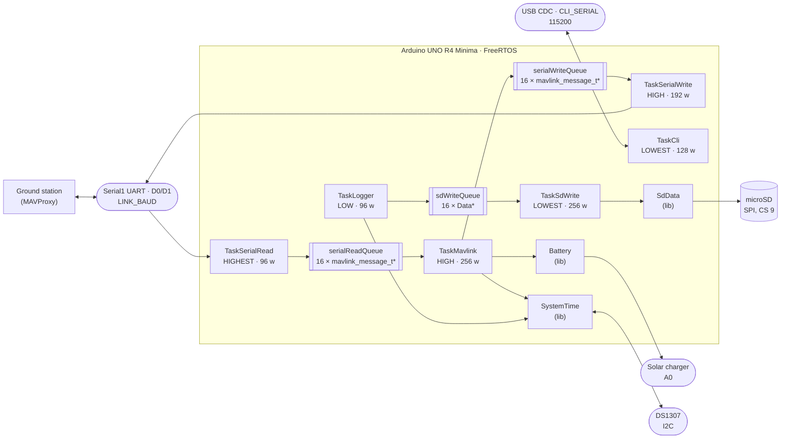

# Architecture

This document describes how the BoredomOS firmware is put together and why it is
split the way it is. It is the single source of truth for the design: `CLAUDE.md`
points here and keeps only what is specific to working with Claude Code, and
`TODO.md` holds everything that is planned but not yet built.

It documents the current state of the code. Anything that is wrong, missing or
inconsistent is tracked as an entry in [TODO.md](TODO.md) rather than described
here.

## 1. What this firmware is

BoredomOS is the on-board software of a CubeSat built on the
[Thingiverse 4096437](https://www.thingiverse.com/thing:4096437) mechanical design.
It runs on an **Arduino UNO R4 Minima** (Renesas RA4M1, Cortex-M4 at 48 MHz, 32 KB
of RAM) under **FreeRTOS**, and is built with PlatformIO.

The satellite presents itself to the ground as a **MAVLink vehicle**. It emits
periodic telemetry, accepts a small set of inbound messages, and keeps a local
housekeeping log on an SD card for the data that is too voluminous or too dull to
send over the link. MAVProxy is the reference ground control station.

Three things the firmware is *not*, which explain a lot of the code: it has no
control loops (nothing is actuated), it has no filesystem abstraction beyond a
fixed ring of log files, and it has no dynamic configuration — the wiring, the
identity on the bus and the telemetry rates are all compiled in.

## 2. The whole system at a glance



Read it as three independent flows sharing one board: everything on the top path is
the MAVLink link, the middle path is the housekeeping log, and `SystemTime` is the
clock that both of them stamp their data with.

## 3. Runtime model

**One composition root.** `src/main.cpp` is the only file that creates anything.
It defines the shared objects (`battery`, `systemTime`), the three queue handles
and the six task handles, then creates every task in `setup()` and calls
`vTaskStartScheduler()`. `loop()` is empty and never runs.

**One task per translation unit.** Every other `src/*.cpp` is a task body — or a
small group of related ones — and reaches the shared objects through `extern`
declarations rather than headers. `src/logger.cpp` declares
`extern QueueHandle_t sdWriteQueue;` and `extern SystemTime systemTime;`; nothing
is passed through `pvParameters`, which is `(void)`-cast away in every task.

Adding a subsystem therefore means four edits, always the same four:

1. Write the task body in a new `src/*.cpp`, reaching what it needs by `extern`.
2. Declare it `[[noreturn]] extern void TaskX(void *pvParameters);` in `src/main.cpp`.
3. Declare its storage there too — a `StackType_t xStack[N]` and a `StaticTask_t` — so
   the linker accounts for the task by name before it exists.
4. `xTaskCreateStatic` it in `setup()` with a priority from `include/Priority.h`, a
   stack size in words, and the storage from step 3. `configASSERT` the handle: with
   static storage a `NULL` can only mean a bad argument.

The one exception to the composition root is `sdData` in `src/sdwrite.cpp`: the
SD ring object is a file-scope global next to its only user, because nothing else
touches the card.

**Priorities are named, never numeric.** `include/Priority.h` defines
`PRIORITY_LOWEST` (0) through `PRIORITY_HIGHEST` (3). The ordering encodes what
must not be starved: reading the link is `HIGHEST` so the receive ring is drained
before it overflows, periodic telemetry and link writing are `HIGH`, protocol
handling and sampling are `LOW`, and SD writing is `LOWEST` because it blocks on
SPI and nothing waits for it.

`TaskSerialWrite` is deliberately **not** `HIGHEST`, even though it is serial I/O.
The core's `UART::write()` busy-waits until the frame is on the wire rather than
buffering and returning. At `HIGHEST` a single `BATTERY_STATUS` frame — 36 bytes of
payload, 48 on the wire once MAVLink 2 trims the trailing zeroes — would stall every
other task for 8.33 ms at 57600 baud. Nothing is lost by transmitting late — the
frame waits in `serialWriteQueue` — so the writer sits at `HIGH`, level with its
only producer, `TaskMavlink`.

`TaskMavlink` does not actually yield every cycle: `xQueueReceive` only blocks when
`serialReadQueue` is empty, and returns at once, without giving up the CPU, whenever
it already holds a frame. A sustained inbound stream could otherwise let `TaskMavlink`
run indefinitely at the same priority as `TaskSerialWrite` and starve it — found in
Copilot's review of `fold-periodic-telemetry-into-mavlink-task`, the change that
raised `TaskMavlink` to this band. `configUSE_TIME_SLICING` is `1` for exactly this:
at `configTICK_RATE_HZ = 1000` the scheduler round-robins same-priority ready tasks
every 1 ms regardless of whether either yields voluntarily, which is what actually
guarantees `TaskSerialWrite` a turn — not any property of `TaskMavlink`'s own code.
See `design.md` in that change.

**The six tasks, and which configuration starts them.** Every task's storage is
declared unconditionally in `src/main.cpp` — the linker counts it whether or not
the task is started — but `setup()` only calls `xTaskCreateStatic` for four of
them in the reduced configuration described below.

| Task | File | Stack | Priority | Cadence | Reduced? |
|---|---|---|---|---|---|
| `TaskSerialRead` | `src/serial.cpp` | 96 w | HIGHEST | polls every 10 ms | yes |
| `TaskSerialWrite` | `src/serial.cpp` | 192 w | HIGH | blocks on `serialWriteQueue` | yes |
| `TaskMavlink` | `src/mavlink.cpp` | 256 w | HIGH | blocks on `serialReadQueue`, wakes at least once a second for its schedule (`HEARTBEAT`/`SYSTEM_TIME` at 1 Hz, 500 ms apart; `BATTERY_STATUS` every 2 s, reduced configuration only) | yes, minus `BATTERY_STATUS` |
| `TaskLogger` | `src/logger.cpp` | 96 w | LOW | every 1 s | no, and not with no SD card either |
| `TaskSdWrite` | `src/sdwrite.cpp` | 256 w | LOWEST | blocks on `sdWriteQueue` | no, and not with no SD card either |
| `TaskCli` | `src/cli.cpp` | 128 w | LOWEST | polls every 10 ms | yes |

`TaskLogger` and `TaskSdWrite` use `vTaskDelayUntil` and `xQueueReceive` with
`portMAX_DELAY` respectively, against a `xLastWakeTime` seeded once for the former,
so their cadence does not drift and both cost nothing when idle. `TaskMavlink` is
the exception: it carries three periodic sends of its own (see §5.1) inside what is
otherwise a `serialReadQueue` consumer, so its `xQueueReceive` timeout is the time
to its next scheduled deadline rather than `portMAX_DELAY` — it wakes at least once
a second regardless of link traffic, never idle-free, which is by design rather than
a departure from the pattern above.

**The boot decision.** `setup()` reads `R_SYSTEM->RSTSR0/1/2` to learn why the
board reset, decodes it into one of five reasons (power-on, low-voltage,
watchdog, software, external/unknown), and updates two counters kept in
`R_SYSTEM->VBTBKR` — the RA4M1's battery-backed registers, which survive any
reset: a count of consecutive boots that never ran stably, and a cumulative
count only a ground command clears. After three consecutive unstable boots or
ten cumulative resets, `setup()` starts only `TaskSerialRead`, `TaskSerialWrite`,
`TaskMavlink` and `TaskCli` — the *reduced configuration*, which keeps the board
reachable and commandable without the SD card, the real-time clock or the battery
sense; `TaskMavlink`'s own schedule additionally withholds `BATTERY_STATUS` in this
configuration (see §5.1), so no task decides that at creation time any more.
`TaskMavlink` also carries the two mechanisms that get the board back out, since it
is the only task that runs in every configuration: it clears the consecutive
counter once the firmware has run for the 5-minute stability window, and, while
reduced, retries the normal configuration every 30 minutes. Both figures are
derived in `openspec/changes/add-degraded-mode/design.md`
from the heap's worst-case leak rate, not guessed. An independent watchdog,
refreshed only from the idle hook, turns a task that stops yielding into a
watchdog reset within `WDT_TIMEOUT_MS`. `include/Recovery.h` and `src/recovery.cpp`
own the register layout and the `PRCR`-unlocked access to it; `src/main.cpp` is
the only file that reads or writes the reset reason, the phase marker and the
counters, and `src/mavlink.cpp` reads them back for the heartbeat and the boot
`STATUSTEXT`. A byte written at each milestone of `setup()` — link, clock, card,
queues, tasks, scheduler-started, or one of the two fault hooks — is what makes a
halt during initialisation nameable at the next boot instead of a silent hang.

The reduced configuration and the watchdog are not finished: `vApplicationStackOverflowHook`
and `vApplicationMallocFailedHook` still rely on the watchdog eventually
underflowing to reset the board rather than resetting themselves, and a hang
during `setup()` before the idle hook first runs is caught only if it occurs
after the watchdog is opened. Both are open items, not this document's claim
about current behaviour.

## 4. Queue memory ownership protocol

This is the rule most easily broken, so it is stated on its own.

**Queues carry heap pointers, never values.** All three queues are declared with
`sizeof(T*)` as their element size. A queue of `mavlink_message_t` by value would
stand permanently reserved at 291 bytes a slot; a queue of pointers is four bytes a
slot, and the messages themselves exist only while they are in flight.

The queue structures and the slot arrays are static, in `.bss`. What is not static is
the items, and the heap is sized to back them — from the number that can *exist*, not
the number that fits in the queues:

| Queue | Depth | Also in existence | Blocks | Bytes |
|---|---|---|---|---|
| `serialReadQueue` | 8 | 1 producer, 1 consumer | 10 x 304 | 3040 |
| `serialWriteQueue` | 4 | 1 producer, 1 consumer | 6 x 304 | 1824 |
| `sdWriteQueue` | 4 | 1 producer, 1 consumer | 6 x 56 | 336 |
| | | | **Total** | **5200** |

against 6136 usable of `configTOTAL_HEAP_SIZE`. The extra blocks are not slack: a
producer allocates *before* it sends, so learning that a queue is full costs a block
beyond the depth; a consumer holds one between `xQueueReceive` and `vPortFree`.
`serialWriteQueue` used to need an extra block for each of three producer tasks that
could hold one at the same instant — `TaskHeartbeat`, `TaskMavlinkBatteryStatus` and
`TaskMavlink`'s timesync reply. Since `fold-periodic-telemetry-into-mavlink-task`
folded the first two into `TaskMavlink`, every send against this queue runs in one
task, so it needs only the one producer block depth already assumed elsewhere in
this table. The 608 bytes this released were not returned to `.bss`:
`configTOTAL_HEAP_SIZE` stays at `0x1800` and the difference is margin, not a queue
depth to spend again without re-deriving it.

**The consequence is which failure a burst finds.** Because the depths are backed, a
saturated queue reports itself through `xQueueSend`, which every producer handles by
freeing the item. Before, the allocator ran out first and returned `NULL` — the path
that is not handled everywhere.

The protocol has exactly three rules, and every producer and consumer follows them:

1. **The producer allocates** with `pvPortMalloc`, fills the struct, and posts the
   pointer with `xQueueSend`.
2. **The producer frees on failure.** If `xQueueSend` does not return `pdPASS` the
   queue is full, the pointer was not handed over, and the producer must
   `vPortFree` it. Skipping this leaks, and on 8 KB of heap a leak is fatal within
   minutes.
3. **The consumer owns the pointer** once `xQueueReceive` returns it, and frees it
   after use — `TaskSdWrite` frees the `Data*` after copying it into the JSON
   document, `TaskMavlink` frees the `mavlink_message_t*` at the end of the switch,
   `TaskSerialWrite` frees it as soon as the frame is serialised into its local
   buffer.

The reference implementations are `src/logger.cpp:42` and `src/serial.cpp:50`,
which also show the fourth half-rule: **check that `pvPortMalloc` returned
something** before writing through the pointer.

## 5. The three pipelines

### 5.1 Serial ↔ MAVLink

`src/serial.cpp` **owns the link port**. It is the only file that performs I/O on
`LINK_SERIAL`; everything else that wants to talk to the ground posts a message to a
queue. No task waits for the port to become ready: a hardware UART has none to wait
for, and the satellite must transmit whether or not anyone is listening.

The port and its speed are named once, in `include/Link.h`, as `LINK_SERIAL` and
`LINK_BAUD`. Both are `#ifndef`-guarded so `build_flags` can override them —
`-D LINK_SERIAL=Serial` puts the link back on USB CDC for bench work without
touching any protocol code. The alias must stay a macro naming a concrete port:
`UART` overloads `write(uint8_t*, size_t)` as non-const and never overrides `Print`'s
virtual const version, so reaching the port through a `HardwareSerial&` would
silently select the per-byte fallback.

- `TaskSerialRead` drains available bytes and feeds them one at a time to
  `mavlink_parse_char`. When a complete message is parsed it is copied to the heap
  and posted to `serialReadQueue`. The parser state (`msg_to_read`, `status`) is
  file-static, which is safe because exactly one task parses.
- `TaskSerialWrite` blocks on `serialWriteQueue`, converts each message to wire
  format with `mavlink_msg_to_send_buffer` into a local buffer, frees the message,
  and writes the bytes.

`src/mavlink.cpp` **owns the protocol**. Nothing else in the firmware knows what a
`msgid` is.

- `TaskMavlink` consumes `serialReadQueue` and dispatches on `msg->msgid`. Two
  messages are acted upon: `SYSTEM_TIME` sets the clock from the ground, and
  `TIMESYNC` with `tc1 == 0` is answered with the satellite's timestamp. Several
  more (`HEARTBEAT`, `PARAM_REQUEST_LIST`, `COMMAND_LONG`, `REQUEST_DATA_STREAM`,
  `FILE_TRANSFER_PROTOCOL`) have explicit cases that are deliberately empty — they
  are the reserved slots for the features in `TODO.md`. Anything else falls to
  `default` and produces a `STATUSTEXT` warning.
- The same task also carries the periodic telemetry that used to run as two
  separate tasks (folded in by `fold-periodic-telemetry-into-mavlink-task`, since
  both did nothing but pack a message and post it on a timer). A
  `{function, interval_ms, last_ms}` schedule table drives absolute deadlines:
  every pass emits whatever is due, then advances `last_ms += interval_ms` rather
  than to "now", so a late pass does not push the cadence forward — this is what
  replaces `vTaskDelayUntil`'s drift-free property now that the sends share a task
  with inbound dispatch. `HEARTBEAT` and `SYSTEM_TIME` fire every 1000 ms, the
  latter's `last_ms` seeded 500 ms behind so the two keep leaving 500 ms apart on
  the wire, exactly as when they alternated on their own `vTaskDelayUntil`.
  `BATTERY_STATUS` fires every 2000 ms, reading `lib/Battery`, and its schedule
  entry is the one disabled in the reduced configuration — the withholding is a
  table flag now, not a task `setup()` chooses not to create.

**Identity on the bus is fixed and must be identical in every outbound message:**
system id `1`, component `MAV_COMP_ID_AUTOPILOT1`, type `MAV_TYPE_ROCKET`,
autopilot `MAV_AUTOPILOT_GENERIC`. A message packed with a different triple appears
to the GCS as a different vehicle or component.

### 5.2 Housekeeping log

The log exists for one purpose: **to size the stacks**. There is no other way to
know how close a 96-word task came to overflowing, and `configCHECK_FOR_STACK_OVERFLOW`
only tells you after the fact.

`src/logger.cpp` samples once a second into the `Data` struct of `include/Data.h`
and posts it to `sdWriteQueue`. The struct is the log schema: Unix time, uptime in
milliseconds, a `System` block with the free FreeRTOS heap and
`uxTaskGetStackHighWaterMark` for each of the five remaining tasks — down from
seven before `fold-periodic-telemetry-into-mavlink-task` removed
`TaskHeartbeat` and `TaskMavlinkBatteryStatus`, whose entries no longer name a
task that exists — and an `Energy` block with the battery millivolts and charge
percentage. `mavlinkAvailableStack` now covers `TaskMavlink`'s inbound dispatch
*and* all three periodic sends it carries (§5.1), so it is the figure that
matters most when checking whether that task's 256-word stack still fits.
Records written before that change carry the old seven-field shape; `lib/SdData`'s
ring can end up holding both shapes at once, and nothing in the firmware reads a
record back, so whoever reads the `.mpk` files on the ground has to tolerate
either.

`src/sdwrite.cpp` **owns the card**. It converts the `Data` into an ArduinoJson
`JsonDocument` and hands it to `lib/SdData`, which — despite the JSON document —
serialises **MessagePack**: the `data0..N.mpk` files are binary, not text.

`lib/SdData` is a fixed-footprint ring, which is what bounds how much of the card
the log can ever occupy. It writes to `data<i>.mpk` until the file reaches its size
limit, then closes it, advances `i` modulo the file count, deletes whatever was
there and opens the next one. The current index is persisted in `index.bin`, so a
power cycle resumes where it left off instead of overwriting from zero. The
footprint is fixed by the two constructor arguments — file count and size per file,
defaulting to 4 files of 1 GiB.

### 5.3 Time

`lib/SystemTime` keeps two clocks in agreement: the RA4M1's internal `RTC`, which is
fast to read but loses time on power loss, and an external **DS1307** on I2C, which
is battery-backed but coarse.

- `begin()` seeds the internal clock from the DS1307 and fails — hard, via
  `configASSERT` in `setup()` — if either does not answer.
- `getUnixTime()` reads the internal clock. `getUnixTimeUsec()` and
  `getUnixTimeNsec()` scale it up for the MAVLink fields that want microseconds and
  nanoseconds.
- `setUnixTime()` writes both clocks and short-circuits when the value is already
  correct, so repeated time messages from the ground do not hammer the I2C bus.

The clock is settable from the ground: inbound `SYSTEM_TIME` and `TIMESYNC` in
`TaskMavlink` are what drive `setUnixTime()`. Every SD record carries the resulting
`unixtime`, which is the reference the `.mpk` files are read against later.

## 6. Hardware map and resource ownership

Wiring is hardcoded, not configurable. Changing a pin means changing the code.

| Resource | Where | Owned by |
|---|---|---|
| MAVLink link, `LINK_BAUD` | `LINK_SERIAL` — `Serial1` on **D0** (`RX`) / **D1** (`TX`) | `src/serial.cpp` |
| USB CDC console, 115200 | `CLI_SERIAL` (`Serial` by default) | `src/cli.cpp` — the one pre-existing exception is `src/hooks.cpp`, which writes from the stack-overflow hook after the scheduler has stopped |
| microSD card | SPI, CS on pin **9** | `src/sdwrite.cpp` via `lib/SdData` |
| Battery / solar charger sense | **A0** | `lib/Battery` |
| DS1307 real-time clock | I2C, address `0x68` | `lib/SystemTime` |
| Internal RTC | on-chip | `lib/SystemTime` |
| Status LED | `LED_BUILTIN` | `src/hooks.cpp` |
| Independent watchdog (WDT) | on-chip, opened in `setup()` | `src/main.cpp` opens it; `src/hooks.cpp`'s idle hook refreshes it |
| Backup registers (`R_SYSTEM->VBTBKR`) | on-chip, `[0..3]` the bootloader's, `[4..11]` this firmware's | `include/Recovery.h` / `src/recovery.cpp` own the layout and access; `src/main.cpp` is the only writer of its content |

The status LED carries the two faults that stop the board, and the patterns are
chosen to be told apart with nothing attached — which is the case they exist for:

| Pattern | Means |
|---|---|
| Slow symmetric blink, 2 s on and 2 s off | A task overflowed its stack |
| Two rapid blinks, then a pause of about a second | An allocation could not be satisfied |

Both hooks mask interrupts and never return, so neither pattern can be produced by a
board that is still running. Neither uses `delay()` or the serial port: the tick and
the USB interrupt are gone by the time they blink, so both busy-wait instead.

"Owned by" is the operative column: each of these has exactly one owner, and code
outside that owner reaches the resource through a queue or through the library
wrapper, never directly. That is what makes the absence of mutexes safe.

`lib/Battery` wraps the `SolarCharger` library on `A0` and caches readings for
125 ms, so several calls in the same telemetry cycle cost one ADC read.
`remaining()` is a naive linear map of 3.5 V–4.2 V onto 0–100 %, which is adequate
for a single LiPo cell and honest about being an estimate.

## 7. Constraints that shape the code

Most of what looks unusual in this firmware follows from four numbers.

**2628 bytes of headroom.** Not 32 KB, and not the 37 % that `pio run` appears to
leave free. Task stacks, control blocks and queue structures are in `.bss`, counted by
the linker; `configTOTAL_HEAP_SIZE` is `0x1800` and backs the queued items only; and
`g_heap`, the main stack and the vector table take another 9472 bytes that the printed
figure omits. `scripts/ram_budget.py` prints the honest total after every link and
fails the build before the headroom runs out. This is why queues carry pointers, why
messages are freed the instant they are consumed, and why adding a library or a task
is a decision rather than a detail — but it is now a decision the build can refuse.

**Stack sizes are in words, not bytes**, and they are tuned tight — 96 to 256 words,
384 to 1024 bytes. `configCHECK_FOR_STACK_OVERFLOW=2` is enabled and
`src/hooks.cpp` traps an overflow into a slow `LED_BUILTIN` blink with interrupts
disabled, and an allocation failure into a fast double blink. **A blinking board means
a stack is too small or memory ran out, not a wiring fault** — the two patterns are in
section 6. After changing any task body, check that task's high-water mark in the SD
log before assuming it still fits.

**Four priority levels**, from `include/Priority.h`, never raw numbers. FreeRTOS is
configured with `configMAX_PRIORITIES` of 5 and a 1000 Hz tick.

**`configASSERT` halts only where recovery is impossible, not where hardware is
missing.** The question `setup()` asks is not "is this important" but "does the
firmware need it to be reachable" — and the answer is: the link, and nothing
else. Absent RTC or SD card degrade instead of halting: the board runs on ticks
since boot and accepts a time set from the ground without the DS1307, and skips
the housekeeping log without the card, reporting the absence either way rather
than staying silent about it. `configASSERT` remains on each queue creation and
each task creation — with `configSUPPORT_STATIC_ALLOCATION` these cannot fail
for want of memory, so a `NULL` handle there is a programming error, not a
hardware fault, and stopping on it is still correct. See
`openspec/changes/add-degraded-mode/` for the reasoning and
`specs/fault-recovery/spec.md` for what a degraded board must still do.

## 8. Build, flash and test

```bash
pio run                  # build — this is all CI runs
pio run -t upload        # flash the board
pio device monitor       # USB console at 115200 — the CLI, see below
mavproxy.py --master=<link port>,57600 --load-module system_time
```

`<link port>` is whatever is wired to D0/D1: the telemetry radio, or a USB-TTL
adapter on the bench. `/dev/ttyACM0` no longer carries MAVLink. To reach the link
over USB again, build with `-D LINK_SERIAL=Serial` and point MAVProxy at
`/dev/ttyACM0,115200` as before.

`pio device monitor` now opens the USB console, which `src/cli.cpp` answers: a text
command per line, a reply, then a prompt, and nothing unsolicited otherwise. Four
commands:

| Command | Reports |
|---|---|
| `ps` | one row per task the scheduler knows about — id, name, priority, state, unused stack in words — then free heap |
| `ps <name>` | the same row for one task |
| `free` | heap total, free now, and the minimum ever free since boot |
| `help`, `?` | the command list |

The CLI is read-only: no command changes firmware state. It is the port's only
writer while tasks run; the one exception is the stack-overflow hook in
`src/hooks.cpp`, which writes there directly after the scheduler has stopped.

**There is no host test environment.** `test/` holds two suites, and they test
different things:

| Suite | Command | What runs where | Covers |
|---|---|---|---|
| `test/test_hil/` | `pio test`, `pio test -e bench` | Python on the development machine, over the link | the real firmware, seen as the ground station sees it |
| `test/test_libs/` | `pio test -e libs` | Unity on the board, replacing the firmware | `lib/` only — `Battery`, `SystemTime`, `SdData`, linked against the Arduino core |

**The default is the HIL suite**, and that is deliberate. It flashes the firmware that
flies and leaves it running; the Unity suite replaces the firmware with a test binary
and erases the log from the card on every case, so it is opt-in.

`test_libs/test_main.cpp` asserts against a real battery voltage, a real DS1307 and a
real SD card, so `pio test` needs the assembled board and cannot run in CI. All its
cases live in that one file and are dispatched by hand from `runUnityTests()`; to run
a single one, comment out the other `RUN_TEST(...)` lines. `pio test -f` filters test
*directories*, so it selects a suite, not a case.

**`test_libs` does not cover `src/` at all.** `test_build_src` defaults to `no`, so
the test binary contains no `main.cpp`, no task creation and no scheduler: it cannot
observe a task, a queue, a stack high-water mark or the ownership protocol. The
section sizes show it — the Unity binary links 5340 bytes of RAM and contains no
`ucHeap`, no `vTaskStartScheduler` and no `xTaskCreateStatic` at all. A green
`pio test -e libs` says nothing about a task body. Note that `test_build_src` governs
`pio test`, not `pio run`: `pio run -e libs` builds the application and carries the
same static storage as the flight build.

**What the build reports, and what it does not.** `pio run` prints
`.data + .noinit + .bss` — 20668 of 32768, about 63 % — which now moves when a task is
added, because the stacks and control blocks are in `.bss`. It still leaves out
`g_heap`, the main stack and the vector table, another 9472 bytes, so on its own it
understates the commitment. `scripts/ram_budget.py` runs after every link and prints
the honest figure: **30140 bytes committed of 32768, 2628 bytes of headroom.** That
headroom is what a new subsystem has to fit into, and the build fails if it drops
below the floor in `platformio.ini`.

`test_hil/` is what exercises the assembled firmware. `run.py` discovers the cases,
prints Unity's line format so `pio test` counts them natively, and reports anything it
cannot check — no board, no adapter — as skipped rather than failed. Nine of the
fourteen cases follow the scenarios in `openspec/specs/mavlink-link/spec.md`; three, in
`check_recovery.py`, follow `fault-recovery`; and two, in `check_cli.py`, follow
`console-cli`.

Its `build_stub.cpp` is not a test. PlatformIO counts the sources it compiled from the
suite directory and refuses to build before it ever reaches `src/`, so a suite that is
entirely host-side Python needs one translation unit to exist at all.

Three environments share the board: `uno_r4_minima` is the flight build and the
default for every command, `bench` is the same firmware with the link on USB so the
HIL suite runs without an adapter on D0/D1, and `libs` exists only to run the Unity
suite.

## What is not here

Planned work, open decisions and known defects live in [TODO.md](TODO.md), one
entry each, defined before any code is written for them. This document describes
what exists; that one describes what should.
