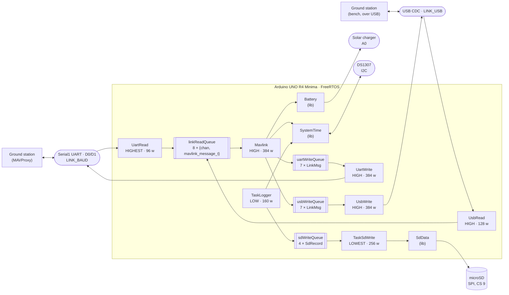

# Architecture

This document describes how the BoredomOS firmware is put together and why it is
split the way it is. It is the single source of truth for the design: `CLAUDE.md`
points here and keeps only what is specific to working with Claude Code, and
`TODO.md` holds everything that is planned but not yet built.

It documents the current state of the code. Anything that is wrong, missing or
inconsistent is tracked as an entry in [TODO.md](TODO.md) rather than described
here.

## 1. What this firmware is

BoredomOS is the on-board software of a CubeSat built on the
[Thingiverse 4096437](https://www.thingiverse.com/thing:4096437) mechanical design.
It runs on an **Arduino UNO R4 Minima** (Renesas RA4M1, Cortex-M4 at 48 MHz, 32 KB
of RAM) under **FreeRTOS**, and is built with PlatformIO.

The satellite presents itself to the ground as a **MAVLink vehicle**. It emits
periodic telemetry, accepts a small set of inbound messages, and keeps a local
housekeeping log on an SD card for the data that is too voluminous or too dull to
send over the link. MAVProxy is the reference ground control station.

Three things the firmware is *not*, which explain a lot of the code: it has no
control loops (nothing is actuated), it has no filesystem abstraction beyond a
fixed ring of log files, and it has no dynamic configuration — the wiring, the
identity on the bus and the telemetry rates are all compiled in.

## 2. The whole system at a glance



Read it as three independent flows sharing one board: everything on the top path is
the MAVLink link — two ports of it, sharing one inbound queue and one protocol task
but keeping a write queue and a writer each — the middle path is the housekeeping
log, and `SystemTime` is the clock that both of them stamp their data with.

There is no console task. The USB port carried a read-only text CLI until
`replace-console-cli-with-usb-mavlink-link`; it is a MAVLink endpoint now, and the
numbers `ps` and `free` used to print reach the ground as the housekeeping stream
(§5.1) instead.

## 3. Runtime model

**One composition root.** `src/main.cpp` is the only file that creates anything.
It defines the shared objects (`battery`, `systemTime`), the two `LinkPort`
descriptors, the four queue handles and the seven task handles, then creates every task in `setup()` and calls
`vTaskStartScheduler()`. `loop()` is empty and never runs.

**One task per translation unit.** Every other `src/*.cpp` is a task body — or a
small group of related ones — and reaches the shared objects through `extern`
declarations rather than headers. `src/logger.cpp` declares
`extern QueueHandle_t sdWriteQueue;` and `extern SystemTime systemTime;`.

`pvParameters` is `(void)`-cast away in every task **except the two link bodies**.
`replace-console-cli-with-usb-mavlink-link` runs `TaskLinkRead` and `TaskLinkWrite`
as two instances each, one per port, and an instance learns which port it serves
from the `LinkPort *` it is given. That is the one thing `pvParameters` is for, and
the alternative was duplicating both bodies. Nothing else uses it, and a new task
that is not per-port should not start.

Adding a subsystem therefore means four edits, always the same four:

1. Write the task body in a new `src/*.cpp`, reaching what it needs by `extern`.
2. Declare it `[[noreturn]] extern void TaskX(void *pvParameters);` in `src/main.cpp`.
3. Declare its storage there too — a `StackType_t xStack[N]` and a `StaticTask_t` — so
   the linker accounts for the task by name before it exists.
4. `xTaskCreateStatic` it in `setup()` with a priority from `include/Priority.h`, a
   stack size in words, and the storage from step 3. `configASSERT` the handle: with
   static storage a `NULL` can only mean a bad argument.

A fifth edit applies to any task whose stack is worth watching: add it to
`src/mavlink.cpp`'s housekeeping table and to the `SYS` record in
`include/SdRecord.h`, or its high-water mark reaches neither the ground nor the SD
log. Both follow the task count, and so does each write queue's depth. Widening `SYS`
means three matching edits and not one — its `SD_RECORD_TASK_COUNT`, the packed
`LogSys` structure in `src/sdwrite.cpp` and that record's `FMT` definition beside it,
whose declared length a `static_assert` checks against the structure. Adding a field
without its label produces plausible-looking wrong numbers on the ground, which is
what those assertions exist to stop.

The one exception to the composition root is `sdData` in `src/sdwrite.cpp`: the
SD ring object is a file-scope global next to its only user, because nothing else
touches the card.

**Priorities are named, never numeric.** `include/Priority.h` defines
`PRIORITY_LOWEST` (0) through `PRIORITY_HIGHEST` (3). The ordering encodes what
must not be starved: reading the link is `HIGHEST` so the receive ring is drained
before it overflows, periodic telemetry and link writing are `HIGH`, protocol
handling and sampling are `LOW`, and SD writing is `LOWEST` because it blocks on
SPI and nothing waits for it.

The writers are deliberately **not** `HIGHEST`, even though they are serial I/O.
The core's `UART::write()` busy-waits until the frame is on the wire rather than
buffering and returning. At `HIGHEST` a single `BATTERY_STATUS` frame — 36 bytes of
payload, 48 on the wire once MAVLink 2 trims the trailing zeroes — would stall every
other task for 8.33 ms at 57600 baud. Nothing is lost by transmitting late — the
frame waits in that port's write queue — so both writers sit at `HIGH`, level with
their only producer, `Mavlink`.

`Mavlink` does not actually yield every cycle: `xQueueReceive` only blocks when
`linkReadQueue` is empty, and returns at once, without giving up the CPU, whenever
it already holds a frame. A sustained inbound stream could otherwise let `Mavlink`
run indefinitely at the same priority as the writers and starve them — found in
Copilot's review of `fold-periodic-telemetry-into-mavlink-task`, the change that
raised it to this band. `configUSE_TIME_SLICING` is `1` for exactly this:
at `configTICK_RATE_HZ = 1000` the scheduler round-robins same-priority ready tasks
every 1 ms regardless of whether either yields voluntarily, which is what actually
guarantees a writer its turn — not any property of `Mavlink`'s own code.
See `design.md` in that change.

It is also what keeps the idle task scheduled against a same-priority task that
spins, and therefore what keeps `vApplicationIdleHook()` refreshing the watchdog.
That mattered for the CLI at `PRIORITY_LOWEST` and matters again for `UsbWrite`,
whose `availableForWrite()` guard is the primary defence (§5.1).

**The seven tasks, and which configuration starts them.** Every task's storage is
declared unconditionally in `src/main.cpp` — the linker counts it whether or not
the task is started — but `setup()` only calls `xTaskCreateStatic` for five of
them in the reduced configuration described below. There were six until
`replace-console-cli-with-usb-mavlink-link` split the link pair per port and
deleted `TaskCli`.

| Task | File | Stack | Priority | Cadence | Reduced? |
|---|---|---|---|---|---|
| `UartRead` | `src/link.cpp` | 96 w | HIGHEST | polls every 10 ms, at most 128 B a pass | yes |
| `UsbRead` | `src/link.cpp` | 128 w | HIGH | polls every 10 ms, at most 128 B a pass | yes |
| `UartWrite` | `src/link.cpp` | 384 w | HIGH | blocks on `uartWriteQueue` | yes |
| `UsbWrite` | `src/link.cpp` | 384 w | HIGH | blocks on `usbWriteQueue` | yes |
| `Mavlink` | `src/mavlink.cpp` | 384 w | HIGH | blocks on `linkReadQueue`, wakes at least once a second for each port's schedule (`HEARTBEAT`/`SYSTEM_TIME` at 1 Hz, 500 ms apart; `SYS_STATUS` at 1 Hz, 750 ms behind `HEARTBEAT`; `BATTERY_STATUS` every 2 s, withheld in the reduced configuration) | yes, minus `BATTERY_STATUS` |
| `TaskLogger` | `src/logger.cpp` | 160 w | LOW | every 1 s | no, and not with no SD card either |
| `TaskSdWrite` | `src/sdwrite.cpp` | 256 w | LOWEST | blocks on `sdWriteQueue` | no, and not with no SD card either |

The two readers sit at different priorities and the reason is the hardware's, not
a preference: D0/D1 has no flow control wired, so bytes not drained in time are
**lost**, while USB CDC NAKs when its buffer fills and can only be delayed. Only
the port that can lose data needs `HIGHEST`.

`UsbWrite` is at `HIGH` only because `TaskLinkWrite` asks `availableForWrite()`
before writing. `_SerialUSB::write()` loops without yielding while its buffer is
full, so above idle priority a host that opens the port and stops reading would
keep `vApplicationIdleHook()` from running and let the watchdog reset the board.
The writer drops the frame instead, exactly as it already does when the queue is
full.

`TaskLogger` and `TaskSdWrite` use `vTaskDelayUntil` and `xQueueReceive` with
`portMAX_DELAY` respectively, against a `xLastWakeTime` seeded once for the former,
so their cadence does not drift and both cost nothing when idle. `TaskMavlink` is
the exception: it carries three periodic sends of its own (see §5.1) inside what is
otherwise a `linkReadQueue` consumer, so its `xQueueReceive` timeout is the time
to its next scheduled deadline rather than `portMAX_DELAY` — it wakes at least once
a second regardless of link traffic, never idle-free, which is by design rather than
a departure from the pattern above.

**The boot decision.** `setup()` reads `R_SYSTEM->RSTSR0/1/2` to learn why the
board reset, decodes it into one of five reasons (power-on, low-voltage,
watchdog, software, external/unknown), and updates two counters kept in
`R_SYSTEM->VBTBKR` — the RA4M1's battery-backed registers, which survive any
reset: a count of consecutive boots that never ran stably, and a cumulative
count only a ground command clears. After three consecutive unstable boots or
ten cumulative resets, `setup()` starts only the four link tasks and `Mavlink`
— the *reduced configuration*, which keeps the board
reachable and commandable without the SD card, the real-time clock or the battery
sense; `TaskMavlink`'s own schedule additionally withholds `BATTERY_STATUS` in this
configuration (see §5.1), so no task decides that at creation time any more.
`TaskMavlink` also carries the two mechanisms that get the board back out, since it
is the only task that runs in every configuration: it clears the consecutive
counter once the firmware has run for the 5-minute stability window, and, while
reduced, retries the normal configuration every 30 minutes. Both figures were
derived in `openspec/changes/archive/2026-09-13-add-degraded-mode/design.md`
from the worst-case leak rate of the FreeRTOS heap that existed then — a derivation
that is **historical, not a current justification**: `replace-messagepack-log-with-dataflash`
moved the last queue off the heap and the allocator is no longer in the image at all
(§4), so the quantity those figures were computed from does not exist any more. They
have not been re-derived against anything the firmware does today, and nothing has
shown them to be wrong either; treat them as inherited constants with a recorded
provenance rather than as numbers this design still stands behind. An independent watchdog,
refreshed only from the idle hook, turns a task that stops yielding into a
watchdog reset within `WDT_TIMEOUT_MS`. `include/Recovery.h` and `src/recovery.cpp`
own the register layout and the `PRCR`-unlocked access to it; `src/main.cpp` is
the only file that reads or writes the reset reason, the phase marker and the
counters, and `src/mavlink.cpp` reads them back for the heartbeat and the boot
`STATUSTEXT`. A byte written at each milestone of `setup()` — link, clock, card,
queues, tasks, scheduler-started, or one of the two fault hooks — is what makes a
halt during initialisation nameable at the next boot instead of a silent hang.

The reduced configuration and the watchdog are not finished: `vApplicationStackOverflowHook`
and `vApplicationMallocFailedHook` still rely on the watchdog eventually
underflowing to reset the board rather than resetting themselves, and a hang
during `setup()` before the idle hook first runs is caught only if it occurs
after the watchdog is opened. Both are open items, not this document's claim
about current behaviour.

## 4. Queue memory ownership protocol

**Every queue carries its items by value, and nothing in the firmware allocates at
run time.** There is no protocol left to get wrong, which is the point of this
section now.

It took two changes to get here. `queue-mavlink-messages-by-value` moved the MAVLink
queues off the heap once their items shrank below the point where by-value storage
cost less than the heap-pointer machinery around it. `replace-messagepack-log-with-
dataflash` then moved the last one, `sdWriteQueue` — not because its item shrank, but
because the flight log's battery record has to come from `TaskMavlink`, the task that
already reads `lib/Battery`, and CI forbids run-time allocation in that file. A
heap-pointer producer there was simply not available.

The consequence is worth stating plainly: **the FreeRTOS heap has no users.**
`configTOTAL_HEAP_SIZE` is `0x0`, and the linker drops `ucHeap`, `prvHeapInit` and
the allocator itself from the image because nothing references them. A run-time
allocation reintroduced anywhere in `src/` now fails on its first call and halts the
board through the malloc-failed hook, which is the behaviour `openspec/specs/memory-
budget/spec.md` prescribes — and CI greps all of `src/` to stop it reaching the board
at all. That grep is textual, so the files that discuss this rule describe it rather
than naming the function.

One counter survives the removal and is a trap for the unwary:
`xPortGetFreeHeapSize()` still links, still compiles, and returns **0 for ever**,
because the variable behind it is only ever written by an allocator that no longer
exists. The housekeeping stream's `HeapFree` and `HeapMin` report that 0, truthfully.
Do not read them as a heap that is full.

**`linkReadQueue` and the two write queues carry their items by value.**
`linkReadQueue`'s element is an `InboundMsg` (292 B): a full `mavlink_message_t`
plus the channel it arrived on, so the protocol task can answer on the port that
asked. One queue serves both readers rather than one each — a second 8-deep
message queue would cost 2328 B to distinguish what the tag distinguishes for 8.
Two producers cost nothing extra here, because a by-value queue has no
producer-held block to reserve.
Each port's write queue element is `LinkMsg` (`include/LinkMsg.h`, 64 B) — a tagged
union of what a producer *means* (a `HEARTBEAT` needs no payload at all; a
`STATUSTEXT` needs a severity and up to 50 characters, which is what sets the
union's size) rather than a wire-ready frame. `src/mavlink.cpp`'s `mavlinkPack()`
is the only place that turns a `LinkMsg` into a `mavlink_message_t`, called by
`TaskLinkWrite` just before it writes, with the channel it is about to leave by — this is also the only function outside
`src/mavlink.cpp` allowed to call a `mavlink_msg_*_pack` function, which is what
keeps protocol knowledge in the one file that owns it (§5.1) even though the
transport (`src/link.cpp`) now does the final packing step.

Their storage is `depth x sizeof(item)`, entirely in `.bss`, and none of them
touches the FreeRTOS heap: `linkReadQueueStorage` is 8 x 292 = 2336 B, and each of
`uartWriteQueueStorage` and `usbWriteQueueStorage` is 7 x 64 = 448 B — depth 7 since
`emit-sys-status` added a fifth independently-clocked schedule entry, whose
derivation is in `src/main.cpp` beside the storage. There is no producer/consumer margin
to add on top — with a by-value queue, an item "held before send" or "held after
receive" is simply a local on that task's own stack, not a shared block, so the
depth alone is what the storage needs.

**`sdWriteQueue` carries its item by value too**, and follows the same rule as the
rest: storage is depth × item size in `.bss`, with no margin added on top.

| Queue | Depth | Item | Bytes in `.bss` |
|---|---|---|---|
| `sdWriteQueue` | 4 | `SdRecord`, 32 B | 128 |

`SdRecord` (`include/SdRecord.h`) is a tagged union of what a producer *means* —
`SYS`, `PWR` or `TIME` — in the same spirit as `LinkMsg`, and for the same reason: the
file that owns the resource is the only one that forms the bytes. `src/sdwrite.cpp`
turns an `SdRecord` into a DataFlash record on its way to the card, and no producer
knows the log's format. It is 32 B rather than the 24 B of its largest payload because
the timestamp is a `uint64_t`, so the union takes 8-byte alignment and the tag costs
8 B of the struct; a `static_assert` in that header holds the figure, because
`src/main.cpp` sizes the storage on it.

**Two producers post to it** — `TaskLogger` for the 1 Hz `SYS` record, `TaskMavlink`
for `PWR` on its battery cadence and `TIME` when a clock set is accepted — and that
costs nothing extra, because a by-value queue has no producer-held block to reserve.

**What a burst finds is now the same at every queue**: a full queue does not accept
the item, `xQueueSend` says so, and the producer has nothing to release because it
never held anything the queue had not already copied. For `sdWriteQueue` the cost of
a refusal is one housekeeping sample, dropped silently — the log has no way to report
its own gaps, which is a known and deliberate hole rather than an oversight.

## 5. The three pipelines

### 5.1 Serial ↔ MAVLink

`src/link.cpp` **owns both link ports**. It is the only file that performs I/O on
`LINK_UART` or `LINK_USB`; everything else that wants to talk to the ground posts a
message to a queue. Both ports in one file, not one file each: two owners of the
same class of resource is what would force mutexes.

No task waits for a port to become ready, but the two ports differ in what that
means. A hardware UART has no readiness to wait for, and the satellite must
transmit whether or not anyone is listening. A USB CDC port does have one:
`_SerialUSB::write()` returns 0 outright with no host attached, so those frames are
discarded rather than waited on — and when a host *is* attached but has stopped
draining, the writer checks `availableForWrite()` and drops the frame instead of
entering the library's non-yielding spin.

The ports and the UART's speed are named once, in `include/Link.h`, as
`LINK_UART`, `LINK_USB` and `LINK_BAUD`, with `LINK_CHAN_UART`/`LINK_CHAN_USB` for
their MAVLink channel numbers. All are `#ifndef`-guarded so `build_flags` can
override them without touching any protocol code. `LINK_BAUD` applies to the UART
alone; a CDC port has no line rate. Each alias must stay a macro naming a concrete
port, and `include/LinkPort.h` reaches them through function pointers onto
per-port wrappers for the same reason:
`UART` overloads `write(uint8_t*, size_t)` as non-const and never overrides `Print`'s
virtual const version, so reaching the port through a `HardwareSerial&` would
silently select the per-byte fallback.

- `TaskLinkRead` — two instances, one per port — drains up to 128 bytes a pass and
  feeds them one at a time to `mavlink_parse_char` on that port's channel. The cap
  bounds a loop that is otherwise unbounded; the UART cannot deliver more than 58 B
  into a 10 ms poll, but USB can. A complete message is posted to `linkReadQueue`
  **by value** (§4). The parser state is no longer file-static — it lives in each
  instance's `LinkPort`, because two tasks parse now and a shared buffer would let
  one port's frame be posted under the other's tag.
- `TaskLinkWrite` — two instances — blocks on its own port's write queue, receives a
  `LinkMsg` by value, calls `src/mavlink.cpp`'s `mavlinkPack()` with its channel to
  turn it into a `mavlink_message_t` on its own stack, converts that to wire format
  with `mavlink_msg_to_send_buffer` into a local buffer, checks the port will accept
  it, and writes the bytes. Nothing is freed, because nothing was allocated.

`src/mavlink.cpp` **owns the protocol**. Nothing else in the firmware knows what a
`msgid` is.

- `Mavlink` — one instance for both ports — consumes `linkReadQueue` (an
  `InboundMsg` by value, not a pointer) and dispatches on `msg.msgid`, replying on
  the port the item's `chan` names and never the other. Two
  messages are acted upon directly: `SYSTEM_TIME` sets the clock from the ground, and
  `TIMESYNC` with `tc1 == 0` is answered with the satellite's timestamp. `HEARTBEAT`,
  `PARAM_REQUEST_LIST`, `REQUEST_DATA_STREAM` and `FILE_TRANSFER_PROTOCOL` have explicit
  cases that are deliberately empty — reserved slots for the features in `TODO.md`.
  `COMMAND_LONG` is no longer one of them: its own sub-switch on `command.command`
  answers `MAV_CMD_PREFLIGHT_REBOOT_SHUTDOWN`, `MAV_CMD_SET_MESSAGE_INTERVAL` and, since
  `answer-autopilot-version-requests`, `MAV_CMD_REQUEST_AUTOPILOT_CAPABILITIES` with
  `AUTOPILOT_VERSION` followed by `COMMAND_ACK`. Since
  `answer-unsupported-command-long-requests`, every other `command.command` — including
  `MAV_CMD_GET_HOME_POSITION`, for which the firmware holds no home position — is answered
  `COMMAND_ACK` / `MAV_RESULT_UNSUPPORTED` instead of falling through unanswered, and a
  `MAV_CMD_SET_MESSAGE_INTERVAL` naming a message id other than `NAMED_VALUE_INT` (252) is
  answered `COMMAND_ACK` / `MAV_RESULT_DENIED` for the same reason: no `COMMAND_LONG`
  leaves this sub-switch unacknowledged. Anything else — a `msgid` this outer switch does
  not recognise at all — falls to `default` and produces a `STATUSTEXT` warning.
- The same task also carries the periodic telemetry that used to run as two
  separate tasks (folded in by `fold-periodic-telemetry-into-mavlink-task`, since
  both did nothing but pack a message and post it on a timer). A
  `{function, interval_ms, last_ms}` schedule table drives absolute deadlines:
  every pass emits whatever is due, then advances `last_ms += interval_ms` rather
  than to "now", so a late pass does not push the cadence forward — this is what
  replaces `vTaskDelayUntil`'s drift-free property now that the sends share a task
  with inbound dispatch. `HEARTBEAT` and `SYSTEM_TIME` fire every 1000 ms, the
  latter's `last_ms` seeded 500 ms behind so the two keep leaving 500 ms apart on
  the wire, exactly as when they alternated on their own `vTaskDelayUntil`.
  `BATTERY_STATUS` fires every 2000 ms, reading `lib/Battery`, and its schedule
  entry is the one disabled in the reduced configuration — the withholding is a
  table flag now, not a task `setup()` chooses not to create. `SYS_STATUS` fires
  every 1000 ms too (`emit-sys-status`), unconditional like `HEARTBEAT` and
  `SYSTEM_TIME` rather than withheld like `BATTERY_STATUS` — the reduced
  configuration is exactly when its sensor-health bitmap and error counters
  matter most — with its own 750 ms offset from `HEARTBEAT` so the two are not
  due on the same pass every single second.
- A fifth entry publishes housekeeping — free heap, minimum-ever-free heap, and
  each live task's stack high-water mark — as one `NAMED_VALUE_INT` (252) per
  pass, round-robin, cycling back to the start after the last live value. It
  starts disabled **on each port independently**: nothing is sent on a port unless
  a ground station arms it there with
  `MAV_CMD_SET_MESSAGE_INTERVAL` targeting message id 252, and the requested
  interval (microseconds on the wire, converted to milliseconds here) is floored
  at 1000 ms — a faster request is answered `COMMAND_ACK` / `MAV_RESULT_DENIED`,
  not silently clamped. The floor holds the cadence guarantee above and bounds
  how often this entry can coincide with the other four on one pass, which is
  what each write queue's depth (§4) is sized against. Each port keeps its own
  armed flag, interval and position in the cycle, so arming one leaves the other
  alone. The armed state is session-scoped, not persisted: a reset returns every
  port to disabled.

**Sequence numbering is per port, and it is not free.** Every `mavlink_msg_*_pack`
call in `src/mavlink.cpp` is the `_pack_chan` form. The plain form takes its
sequence from channel 0 unconditionally, so with two ports both streams would share
one counter and each ground station would see gaps and infer packet loss.
`current_tx_seq` lives in `mavlink_status_t[chan]`, so passing the channel is the
whole of what keeps the two streams independent — and `MAVLINK_COMM_NUM_BUFFERS` in
`platformio.ini` must be at least the number of channels, which is why it is 2.

**Identity on the bus is fixed and must be identical in every outbound message, on
both ports:** system id `1`, component `MAV_COMP_ID_AUTOPILOT1`, type
`MAV_TYPE_ROCKET`, autopilot `MAV_AUTOPILOT_GENERIC`. A message packed with a
different triple appears to the GCS as a different vehicle or component, and the
two ports must show one vehicle rather than two.

### 5.2 Housekeeping log

The log exists for one purpose: **to size the stacks**. There is no other way to
know how close a 96-word task came to overflowing, and `configCHECK_FOR_STACK_OVERFLOW`
only tells you after the fact.

**The format is ArduPilot DataFlash**, in `data<i>.BIN`. That was chosen for three
reasons specific to this project, none of them general merit: the reader is already a
dependency (`pymavlink`'s `DFReader`, from the same family as the reference GCS, so
nothing project-specific has to exist on the ground); every record opens with
`0xA3 0x95`, a resynchronisation marker, so a log truncated by the power dying
mid-write — the expected ending — costs the truncated record rather than the rest of
the file; and the `FMT` records make schema evolution additive, so a new sensor
declares a new record type instead of widening an existing one and old logs stay
readable.

Four record types, none of them a wide combined record:

| id | name | format | labels | bytes | when |
|---|---|---|---|---|---|
| 128 | `FMT` | `BBnNZ` | `Type,Length,Name,Format,Columns` | 89 | preamble, one per type |
| 129 | `TIME` | `QIB` | `TimeUS,Unix,Src` | 16 | file open, and on an accepted clock set |
| 130 | `SYS` | `QHHHHHHHH` | `TimeUS,Heap,Log,SdW,Mav,SRd,SWr,URd,UWr` | 27 | 1 Hz |
| 131 | `PWR` | `QHb` | `TimeUS,mV,Pct` | 14 | with the battery's own read cadence |

~34 B/s, against the ~251 B/s of the MessagePack records this replaced, 87 % of which
were field-name strings rewritten 86 400 times a day.

`Mav` covers `Mavlink`'s inbound dispatch *and* every periodic send it carries for both
ports (§5.1), so it is the figure that matters most when checking whether that task's
384-word stack still fits. **`Heap` reads 0 and always will** — see §4; it is not a
heap that is full, it is a heap that does not exist.

Separating `PWR` from `SYS` is what makes an absent battery reading *absent*. Before
this split the battery fields were part of the 1 Hz record and `src/logger.cpp` never
filled them, so every `.mpk` file ever written carried `millivolts: 0`. `PWR` now comes
from `TaskMavlink`, the task that already reads `lib/Battery` — which also keeps that
library's unguarded 125 ms cache out of two priorities at once.

`src/sdwrite.cpp` **owns the card and the format**. It is the only place that turns an
`SdRecord` into DataFlash bytes. `lib/SdData` moves bytes and owns the ring, the index
and rotation, and knows nothing about what it is writing.

The `FMT` preamble is re-emitted every time a file is opened, which is what makes each
file of the ring readable on its own. `lib/SdData` invokes a callback after any
successful open — at `begin()` and again on rotation — and that callback writes the
preamble through `writeRaw()`, which appends without checking the size limit and
therefore cannot rotate. That split is the whole reason the callback cannot re-enter
the rotation that invoked it. The preamble itself is constant and lives in flash, so it
costs no RAM; the `TIME` record that follows it carries a live value and is built by
`TaskSdWrite`, which has to be able to do so because rotation happens inside it.

`begin()` opens unconditionally: it closes whatever the object was holding, reads the
index and opens the file that index names. The callback is invoked on **every successful
open**, and on no other path — a `begin()` whose `SD.open()` fails returns without
notifying, which is the same silence a failed open has always produced and is part of
*SD logging failure is silent* rather than of this contract. So a second `begin()`
appends a second preamble, which is what makes a reopened file readable from the point of
reopening; it is a reopen, not an idempotent call. `begin()` used to open only when
nothing was held, which made a second call a silent no-op that kept a file the index had
moved away from — harmless in flight, where `TaskSdWrite` calls it once, and the reason
the callback's `begin()` path went untested for as long as it did. `end()` exists for the
same reason, closing the file so the card can be modified underneath; the firmware never
calls it, and the Unity suite does, before it deletes the log files.

`lib/SdData` is a fixed-footprint ring, which is what bounds how much of the card
the log can ever occupy. It writes to `data<i>.BIN` until the file reaches its size
limit, then closes it, advances `i` modulo the file count, deletes whatever was
there and opens the next one. The current index is persisted in `index.bin`, so a
power cycle resumes where it left off instead of overwriting from zero. The
footprint is fixed by the two constructor arguments — file count and size per file,
defaulting to **4 files of 1 MiB**, so 4 MiB of card in total. At ~34 B/s a file
covers about 8.6 h and the whole ring about 34 h, which puts rotation several times a
day and each file under four minutes down a 57 600 baud link.

Note what the delete-then-open gives the reader: a file always starts empty, so it
never holds records from an earlier lap after the write cursor, and the ambiguity a
circular log usually has does not arise. The price is that the delete walks a FAT
chain proportional to the file size. On the card measured on 2026-09-21 — FAT32,
32 KiB clusters, two FATs — deleting a megabyte is about 3 sector operations if the
chain is contiguous and at most 96 if it is fully fragmented. At the 1 GiB default
this replaced, those figures were 768 and **98 304**, the latter tens of seconds
against a `WDT_TIMEOUT_MS` of 1398. That risk was unarmed only because filling a
gigabyte at this rate takes about a year; the small files remove it rather than
expose it. `test_report_sd_volume_geometry` in the Unity suite reports all of these
for whatever card is fitted — **run it with `pio test -e libs -v`, because plain
`pio test` prints only pass/fail and hides `TEST_MESSAGE` output entirely.**

**Writes are batched, and that is what a power cut costs.** `write()` appends and
syncs once per 4 KiB rather than once per record. A per-record sync cost two sector
writes and two reads for a 27-byte record — `SdVolume`'s single shared 512 B cache
block is evicted by the `sync()` that just filled it, so the next record read it back,
and the directory entry was rewritten every time, about 129 600 times a day onto the
same sector. Batching lets the block fill and be written once, for roughly 36× fewer
sector writes. `writeRaw()` still syncs on every call, because it carries the `FMT`
preamble and a preamble that does not reach the card costs the whole file rather than
its tail. The consequence — power loss costs at most the log written since the last
sync, about two minutes at the current rate — is a requirement in
`openspec/specs/flight-log/spec.md`, not an implementation detail.

Older cards may still hold `data<i>.mpk` files in the retired MessagePack format, in
any of three incompatible record shapes. Nothing converts or reclaims them: the
extensions differ, so the firmware never touches them again.

#### Reading a stack high-water mark out of the log

`CLAUDE.md` has told you to do this after changing a task body since long before it
was possible. It is possible now, and this is how. Pull the card, copy a `data<i>.BIN`
to a host, and read it with `pymavlink` — already a dependency of
`test/test_hil/requirements.txt`, so nothing new is needed:

```python
from pymavlink import DFReader
log = DFReader.DFReader_binary("data0.BIN")
while True:
    m = log.recv_msg()
    if m is None:
        break
    if m.get_type() == "SYS":
        print(m.TimeUS, m.Log, m.SdW, m.Mav, m.SRd, m.SWr, m.URd, m.UWr)
```

Each field is **words of stack still free** at that moment — the minimum ever seen, not
an instantaneous reading, so it only falls. The field names are `SYS`'s labels:
`Log`, `SdW`, `Mav`, `SRd`, `SWr`, `URd`, `UWr` for logger, SD write, MAVLink, and the
UART and USB reader/writer pairs. Compare against the stack sizes in §3's task table;
what matters is the margin, and this project's convention is to leave a comparable one
to the rest of the fleet rather than a round number.

The same figures reach the ground live as the `NAMED_VALUE_INT` housekeeping stream
(§5.1), which a GCS arms with `MAV_CMD_SET_MESSAGE_INTERVAL` on message id 252 at or
above a 1000 ms interval. Reading both and finding they agree is the cheapest way to
know neither is lying. `Heap` is in the record for historical continuity and reads 0 —
see §4.

### 5.3 Time

`lib/SystemTime` owns both clocks. The RA4M1's internal `RTC` is not one of two peers:
it is the **register that holds and advances the time**, and everything else seeds it.
The external **DS1307** on I2C is battery-backed and crystal-driven; the internal RTC
runs off `LOCO`, an on-chip RC oscillator, so it is the worse keeper of the two and the
DS1307 exists to seed it.

- `begin()` starts the internal RTC **unconditionally**, then chooses where the time
  came from. Nothing here halts: a missing clock degrades, per §7.
- `getUnixTime()` reads whole seconds. `getUnixTimeUsec()` and `getUnixTimeNsec()` add a
  sub-second part read from the RTC's own `R64CNT` register — 1/128 s, phase-locked to the
  second it accompanies because the same divider chain produces both. That register's name
  says "64-Hz counter" and means something else: its bits are named for the frequency each
  one toggles at, so a whole second spans its seven bits as 128 counts.
  The read takes the second either side of the fraction and retries while it moved, or a
  carry between the two reads would report a time a second in the past.
- `setUnixTime()` reports whether it accepted the value. It refuses an implausible one
  (before 2022-01-01) and refuses a demotion, writes both clocks, and shifts the boot
  epoch by the same delta.

**Provenance is ranked, and the internal RTC is not on the ladder.** Lower is better,
after ArduPilot's `AP_RTC::source_type`, including its ordering — the ground outranks the
hardware clock:

| Source | Means |
|---|---|
| `ground` | set from the ground this boot |
| `ds1307` | seeded from the DS1307 by `begin()` |
| `survived` | the internal RTC was already running, with a plausible time, when this boot began |
| `none` | nothing seeded it; the internal RTC is counting from the epoch |

The plausibility floor does double duty: it validates what arrives from the ground, and
it is how `begin()` tells a `survived` clock from one that was never set, which is what
lets a ground-set time outlive a reset with nothing persisted to `VBTBKR`.

**Time since boot is a subtraction, not a counter.** `begin()` latches the wall clock
into a `uint32_t` boot epoch — `uint32_t` and not `time_t`, which is 8 bytes here and
would not store in one word — and elapsed time is `wall − epoch`. There is no
accumulator to maintain and nothing to wrap. `setUnixTime()` shifts the epoch by the
same delta it applies to the clock, so elapsed time is continuous across a clock set;
that separation is what lets this firmware accept a **backwards** correction, which an
autopilot coupling the two cannot. Only `TaskMavlink` reads elapsed time today, and it
is also its only writer — before a second task reads it, the clock-and-epoch update must
be made indivisible.

The clock is settable from the ground by inbound `SYSTEM_TIME` in `TaskMavlink`, which is
the only message that drives `setUnixTime()` — `TIMESYNC` is answered, never acted on, and
the claim here that it set the clock too was wrong before this section was rewritten. It is
answered with elapsed
time since boot in nanoseconds, captured when the request arrives rather than when the
reply is packed. With no origin, `SYSTEM_TIME` carries `0` for the UNIX field — the
protocol's "not known" — rather than a date in 1970. The log's `TIME` record carries the
resulting `unixtime` in whole seconds together with the origin it came from, and every
other record is stamped with elapsed time since boot, so a file can be placed on an
absolute timeline and a mid-mission clock correction is visible rather than appearing as
an unexplained jump.

## 6. Hardware map and resource ownership

Wiring is hardcoded, not configurable. Changing a pin means changing the code.

| Resource | Where | Owned by |
|---|---|---|
| MAVLink link, `LINK_BAUD` | `LINK_UART` — `Serial1` on **D0** (`RX`) / **D1** (`TX`) | `src/link.cpp` |
| MAVLink link, USB CDC | `LINK_USB` (`Serial` by default) | `src/link.cpp` — the one exception is `src/hooks.cpp`, which writes from the stack-overflow hook after the scheduler has stopped |
| microSD card | SPI, CS on pin **9** | `src/sdwrite.cpp` via `lib/SdData` |
| Battery / solar charger sense | **A0** | `lib/Battery` |
| DS1307 real-time clock | I2C, address `0x68` | `lib/SystemTime` |
| Internal RTC | on-chip | `lib/SystemTime` |
| Status LED | `LED_BUILTIN` | `src/hooks.cpp` |
| Independent watchdog (WDT) | on-chip, opened in `setup()` | `src/main.cpp` opens it; `src/hooks.cpp`'s idle hook refreshes it |
| Backup registers (`R_SYSTEM->VBTBKR`) | on-chip, `[0..3]` the bootloader's, `[4..11]` this firmware's | `include/Recovery.h` / `src/recovery.cpp` own the layout and access; `src/main.cpp` is the only writer of its content |

The status LED carries the two faults that stop the board, and the patterns are
chosen to be told apart with nothing attached — which is the case they exist for:

| Pattern | Means |
|---|---|
| Slow symmetric blink, 2 s on and 2 s off | A task overflowed its stack |
| Two rapid blinks, then a pause of about a second | An allocation could not be satisfied |

Both hooks mask interrupts and never return, so neither pattern can be produced by a
board that is still running. Neither uses `delay()` or the serial port: the tick and
the USB interrupt are gone by the time they blink, so both busy-wait instead.

"Owned by" is the operative column: each of these has exactly one owner, and code
outside that owner reaches the resource through a queue or through the library
wrapper, never directly. That is what makes the absence of mutexes safe.

`lib/Battery` wraps the `SolarCharger` library on `A0` and caches readings for
125 ms, so several calls in the same telemetry cycle cost one ADC read.
`remaining()` is a naive linear map of 3.5 V–4.2 V onto 0–100 %, which is adequate
for a single LiPo cell and honest about being an estimate.

## 7. Constraints that shape the code

Most of what looks unusual in this firmware follows from four numbers.

**2916 bytes of headroom** (as of `replace-console-cli-with-usb-mavlink-link`,
which added a reader, a writer, a write queue and a second MAVLink channel and
recovered a little of it by deleting the CLI task — see §3's task table; read fresh
from
a build rather than trusted from here, since this figure moves whenever a change
touches `.data`, `.noinit` or `.bss`). Not 32 KB, and not what `pio run`'s own
printed percentage appears to leave free. Task stacks, control blocks and queue
structures are in `.bss`, counted by the linker; `configTOTAL_HEAP_SIZE` is `0x0`
because every queue carries its items by value and nothing allocates at run time
(§4); and `g_heap`, the main stack and the
vector table take another 9472 bytes that the printed figure omits.
`scripts/ram_budget.py` prints the honest total after every link and fails the build
before the headroom runs out. This is why every queue carries by-value items, why the
FreeRTOS allocator is not merely unused but absent from the image, and why adding a
library or a task is a decision rather than a detail — but it is now a decision the
build can refuse.

**Stack sizes are in words, not bytes**, and they are tuned tight — 96 to 384 words,
384 to 1536 bytes. `configCHECK_FOR_STACK_OVERFLOW=2` is enabled and
`src/hooks.cpp` traps an overflow into a slow `LED_BUILTIN` blink with interrupts
disabled, and an allocation failure into a fast double blink. **A blinking board means
a stack is too small or memory ran out, not a wiring fault** — the two patterns are in
section 6. After changing any task body, check that task's high-water mark in the SD
log before assuming it still fits.

**Four priority levels**, from `include/Priority.h`, never raw numbers. FreeRTOS is
configured with `configMAX_PRIORITIES` of 5 and a 1000 Hz tick.

**`configASSERT` halts only where recovery is impossible, not where hardware is
missing.** The question `setup()` asks is not "is this important" but "does the
firmware need it to be reachable" — and the answer is: the link, and nothing
else. Absent RTC or SD card degrade instead of halting: without the DS1307 the
internal RTC still runs, counting from the epoch, so the board operates on time
measured from boot and accepts a time set from the ground — reporting `0` rather
than a date in 1970 for as long as nothing has set it (§5.3) — and skips the
housekeeping log without the card, reporting the absence either way rather
than staying silent about it. `configASSERT` remains on each queue creation and
each task creation — with `configSUPPORT_STATIC_ALLOCATION` these cannot fail
for want of memory, so a `NULL` handle there is a programming error, not a
hardware fault, and stopping on it is still correct. See
`openspec/changes/archive/2026-09-13-add-degraded-mode/` for the reasoning and
`specs/fault-recovery/spec.md` for what a degraded board must still do.

## 8. Build, flash and test

```bash
pio run                  # build — this is all CI runs
pio run -t upload        # flash the board
mavproxy.py --master=/dev/ttyACM0 --load-module system_time       # over USB
mavproxy.py --master=<uart port>,57600 --load-module system_time  # over D0/D1
```

`<uart port>` is whatever is wired to D0/D1: the telemetry radio, or a USB-TTL
adapter on the bench. Since `replace-console-cli-with-usb-mavlink-link`,
`/dev/ttyACM0` carries MAVLink again — in every build, not behind an override —
so a ground station reaches the flight firmware over the USB cable with nothing
else attached. Both ports are live at once and each shows the same vehicle.

`pio device monitor` is no longer useful: the USB port carries binary MAVLink
frames, not text. There is no console and no CLI. The `ps` and `free` figures it
used to print — free heap, minimum-ever-free heap and each live task's stack
high-water mark — reach the ground as the `NAMED_VALUE_INT` housekeeping stream
instead (§5.1), armed by `MAV_CMD_SET_MESSAGE_INTERVAL` and off after every
reset.

That is a loss as well as a gain, and worth stating plainly: `ps` answered
immediately, with every task at once, from any terminal. The housekeeping stream
needs `pymavlink`, an arming command, and about eight seconds to cycle the whole
set at the 1000 ms floor — and it travels through the subsystem you are most
likely to be debugging.

The stack-overflow hook in `src/hooks.cpp` still writes text to the USB port
directly, after the scheduler has stopped. Nothing else does.

**There is no host test environment.** `test/` holds two suites, and they test
different things:

| Suite | Command | What runs where | Covers |
|---|---|---|---|
| `test/test_hil/` | `pio test` | Python on the development machine, over either port | the real firmware, seen as the ground station sees it |
| `test/test_libs/` | `pio test -e libs` | Unity on the board, replacing the firmware | `lib/` only — `Battery`, `SystemTime`, `SdData`, linked against the Arduino core |

**The default is the HIL suite**, and that is deliberate. It flashes the firmware that
flies and leaves it running; the Unity suite replaces the firmware with a test binary
and erases the log from the card on every case, so it is opt-in.

`test_libs/test_main.cpp` asserts against a real battery voltage, a real DS1307 and a
real SD card, so `pio test` needs the assembled board and cannot run in CI. All its
cases live in that one file and are dispatched by hand from `runUnityTests()`; to run
a single one, comment out the other `RUN_TEST(...)` lines. `pio test -f` filters test
*directories*, so it selects a suite, not a case.

**`test_libs` does not cover `src/` at all.** `test_build_src` defaults to `no`, so
the test binary contains no `main.cpp`, no task creation and no scheduler: it cannot
observe a task, a queue, a stack high-water mark or the ownership protocol. The
section sizes show it — the Unity binary links 5340 bytes of RAM and contains no
`ucHeap`, no `vTaskStartScheduler` and no `xTaskCreateStatic` at all. A green
`pio test -e libs` says nothing about a task body. Note that `test_build_src` governs
`pio test`, not `pio run`: `pio run -e libs` builds the application and carries the
same static storage as the flight build.

**What the build reports, and what it does not.** `pio run` prints
`.data + .noinit + .bss` — about 60 % — which now moves when a task
or a queue's storage is added or resized, because the stacks, control blocks and
queue storage are in `.bss`. It still leaves out `g_heap`, the main stack and the
vector table, another 9472 bytes, so on its own it understates the commitment.
`scripts/ram_budget.py` runs after every link and prints the honest figure:
**29852 bytes committed of 32768, 2916 bytes of headroom** (as of
`replace-console-cli-with-usb-mavlink-link`; read fresh from a build rather than
trusted from here, since this figure moves whenever a change touches `.data`,
`.noinit` or `.bss`).
That headroom is what a new subsystem has to fit into, and the build fails if it drops
below the floor in `platformio.ini`.

`test_hil/` is what exercises the assembled firmware. `run.py` discovers the cases,
prints Unity's line format so `pio test` counts them natively, and reports anything it
cannot check — no board, no adapter — as skipped rather than failed. Most of its
cases follow the scenarios in `openspec/specs/mavlink-link/spec.md`, and three, in
`check_recovery.py`, follow `fault-recovery`. `console-cli` no longer exists, so
neither do the cases that covered it.

Which case covers which scenario is still not recorded, and the suite has grown
since anyone last counted — see *Record which scenario each HIL case covers* in
[TODO.md](TODO.md). Two steps nothing here can run at all are written down in
`test/test_hil/README.md` rather than left to look covered.

Its `build_stub.cpp` is not a test. PlatformIO counts the sources it compiled from the
suite directory and refuses to build before it ever reaches `src/`, so a suite that is
entirely host-side Python needs one translation unit to exist at all.

Two environments share the board: `uno_r4_minima` is the flight build and the
default for every command, and `libs` exists only to run the Unity suite. There
were three until `replace-console-cli-with-usb-mavlink-link` retired `bench`,
which existed to move MAVLink onto USB so the HIL suite could run without an
adapter — USB carries MAVLink in every build now, so there is nothing left for
that override to do, and nothing to reflash afterwards to get back to the
configuration that flies.

## What is not here

Planned work, open decisions and known defects live in [TODO.md](TODO.md), one
entry each, defined before any code is written for them. This document describes
what exists; that one describes what should.
